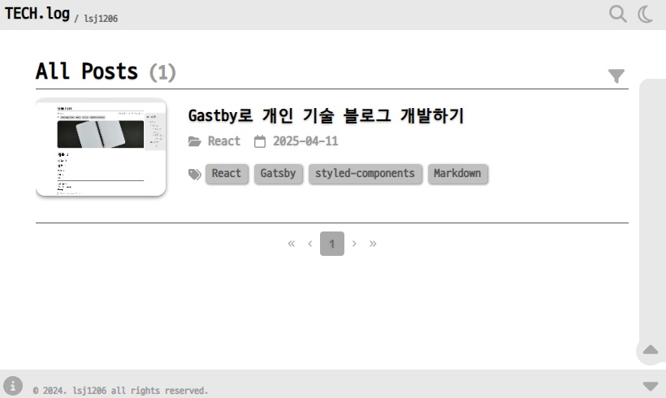

> ## [→ TECH.log/lsj1206](https://lsj1206.github.io)

[](https://lsj1206.github.io)

## 개요

해당 블로그는 **Gatsby**와 **GitHub Pages**를 사용해서 개발된 개인 블로그 프로젝트입니다.

프로젝트는 _2024년 11월 25일_ - _2024년 12월 17일_ 동안 개발되었으며, 블로그 배포일은 _2024년 12월 26일_ 입니다.

## 특징

- **Non-DB** : DB와 서버가 없는 정적 웹사이트 구조로 더 빠르고 관리가 용이함.
- **Markdown** : 간단한 텍스트 형식인 *Markdown*으로 블로그 포스트 작성.
- **Comment** : *Github*의 _Discussions_ 기능을 사용하여 댓글 시스템 구현
- **Responsive Web** : 반응형 웹디자인을 적용.
- **Minimal Design** : 콘텐츠에 집중할 수 있도록 간단하고 깔끔한 UI 제공.
- **Icon Button** : 아이콘을 사용하여 텍스트를 최소화한 UI 제공.
- **Monospace Font** : 네이버에서 개발한 프로그래밍 글꼴인 [D2Coding](https://github.com/naver/d2codingfont) 폰트를 사용해 가독성 향상

## 기술

- [**Gatsby 5.14 (React 18)**](https://www.gatsbyjs.com) : 정적 사이트 생성기
- [**GitHub Flavored Markdown**](https://github.github.com/gfm) : GitHub에서 사용되는 확장된 Markdown
- [**Giscus**](https://giscus.app/ko) : Github의 Discussions 기능을 사용하는 댓글 시스템
- [**styled-components**](https://styled-components.com) : 컴포넌트 기반의 CSS 스타일링
- [**Font Awesome**](https://fontawesome.com) : SVG 아이콘 라이브러리 (CC BY 4.0)

## 시작하기

### 1. 리포지토리 클론

```shell
git clone https://github.com/lsj1206/lsj1206.github.io.git
```

#### 원격 저장소 URL 변경하기

```shell
git remote set-url origin https://github.com/[ENTER NAME]/[ENTER REPOSITORY].git
```

#### 변경 후 확인

```shell
git remote -v
```

### 2. package.json 파일의 `deploy` 주소 수정

```json
"scripts": {
    "deploy": "gatsby build --prefix-paths && gh-pages -d public -r https://github.com/[ENTER NAME]/[ENTER REPOSITORY].git",
  },
```

### 2. `siteUrl` 수정

```javascript
// gatsby-config.js
siteMetadata: {
    title: "TECH.log",
    siteUrl: "https://[ENTER YOUR URL]",
  },
```

### 3. `User Data` 수정

```javascript
// user-data.js
const userData = {
  url: `https://[ENTER LINK]`,
  title: `TECH.log`,
  name: `[ENTER NAME]`,
  self_introduction: `[ENTER SELF INTRODUCTION]`,
  email: `[ENTER E-MAIL]`,
  github_link: `https://github.com/[ENTER LINK]`,
};
```

### 4. Profile 수정

`src/assets/images/Profile.png` 파일 변경 <br>
만약 파일 주소나 이름이 변경된다면 아래 코드 변경

```jsx
// pages/about.js
<StaticImage src="../assets/images/Profile.png" />
```

### 5. Giscus 설정

[Giscus](https://giscus.app/ko) 주소에 접속해서 설정 순서대로 진행

```javascript
// user-data.js
const giscusData = {
  repo: "[ENTER REPO HERE]",
  repo_id: "[ENTER REPO ID HERE]",
  category: "[ENTER CATEGORY NAME HERE]",
  category_id: "[ENTER CATEGORY ID HERE]",
  mapping: "pathname",
  reactions_enabled: "1",
  emit_metadata: "1",
  input_position: "bottom",
  lang: "ko",
};
```

### 6. 포스트 작성

`_posts` 폴더에 폴더를 생성하여 작성

#### 포스트 작성 규칙

1. 아래와 같은 폴더 구조를 가져야 합니다.
2. 폴더명은 포스트의 URL 마지막주소가 됩니다.
3. 2번의 이유로 폴더명은 중복되지 않아야 합니다.
4. 포스트 정보는 _.md_ 파일의 최상단에 작성되어야 합니다. _(Frontmatter)_

```
project-root/
├── _posts/
│   ├── [포스트 URL 주소]/
│   │   ├── _assets/
│   │   │   └── image.jpg
│   │   └── content.md
└── README.md
```

_Frontmatter_ 요구 사항

```markdown
---
title: "Temp Post" // 포스트 제목
coverImage: "./_assets/image1.jpg" //포스트 커버 이미지
category: "Temp" //카테고리
tag: ["Temporary Files", "React", "Gatsby", "styled-components"] //태그 목록
createDate: "2024-11-25" // 최초 작성일
lastDate: "2024-12-12" // 최종 수정일
---
```

#### 7. Github Pages 설정

이제 레포지토리에서 GitHub Pages를 활성화해야 합니다.

1. 레포지토리로 이동합니다.
2. 상단의 Settings 탭으로 이동해서, 왼쪽 메뉴에서 Pages를 클릭합니다.
3. Source 옵션에서 gh-pages 브랜치를 선택하고, Save를 클릭하여 변경사항을 저장합니다.

#### 8. 배포 실행 및 확인

```shell
npm run deploy
```

배포가 완료되면 사이트가 정상적으로 표시되는지 확인합니다.
