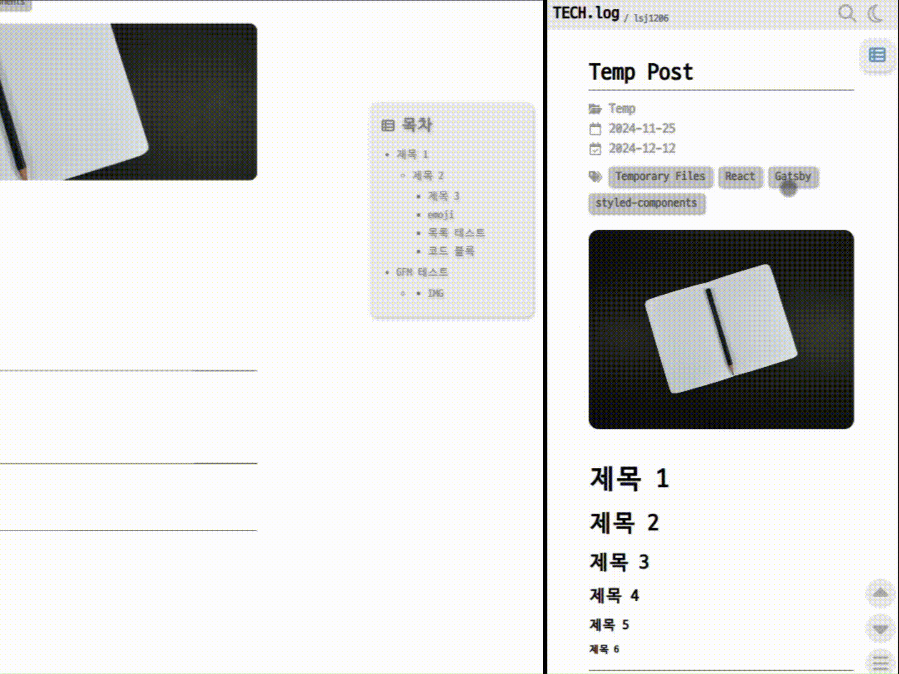

# 개요

- 프로젝트 이름
  - **TECH.log**
- 기술 구성
  - **프론트엔드**
    - `Gatsby v5.14` : React 기반의 정적 사이트 생성 프레임워크
    - `styled-components v6.1` : CSS-in-JS 라이브러리
    - `Font Awesome` : 아이콘 제공 라이브러리
  - **데이터**
    - `Markdown (GFM)` : 블로그 콘텐츠 관리
    - `GraphQL` : 데이터 쿼리 및 처리
  - **빌드 및 배포**
    - `Node.js v22.11` : 개발 서버 실행 및 정적 파일 빌드
    - `GitHub Pages` : 정적 사이트 배포
  - **확장 기능**
    - `Giscus` : GitHub Discussions 기반의 댓글 시스템
- 개발 환경
  - OS : Windows 11
  - Editor : Visual Studio Code
- 개발 기간
  - 개발 기간 : 2024-11-25 ~ 2024-12-17
  - 최초 배포 : 2024-12-26

---

개인 학습 내용과 프로젝트 경험을 기록하기 위한 기술 블로그가 필요하다고 느꼈고, 공부도 할 겸 직접 마음에 드는 스타일로 개발해 보자는 생각이 들어서 프로젝트를 진행하게 됐습니다.

# Gatsby를 선택한 이유

개인 기술 블로그를 개발할 때 가장 중요하게 고려한 부분은 **유지보수와 게시글 작성의 편의성**입니다.

개인 블로그는 대규모 사용자 트래픽이나 복잡한 동작이 필요하지 않으므로, 서버나 DB가 없는 구조를 사용하면 간단하게 유지보수할 수 있다고 생각했습니다.
이러한 요구사항을 충족하는 개발 방식을 찾던 중에 `Gatsby`를 선택했습니다.

## Gatsby

`Gatsby`는 React 기반의 오픈소스 프레임워크로, `React`와 `GraphQL`을 기반으로 동작하며, **정적 사이트 생성기(Static Site Generator, SSG)** 역할을 합니다.

> **_Gatsby vs Jekyll_** <br> Jekyll 같은 경우, GitHub Pages와 친화적이라는 장점이 있지만 Ruby 기반이라는 부분과 웹페이지의 디자인을 직접 구현할 예정이라 익숙한 React + styled-components를 사용하기 위해 Gatsby를 선택했습니다.

> **_Gatsby vs Next.js_** <br> 정적 구조의 개인 기술 블로그이기 때문에 동적 콘텐츠 처리에 장점을 가지는 Next.js는 프로젝트의 요구사항에는 과하다고 생각해서 Gatsby를 선택하였습니다.

## 정적 사이트

**정적 사이트**는 미리 만들어진 HTML, CSS, JavaScript 파일로 구성된 웹사이트로, 사용자가 요청할 때 서버가 이 파일들을 그대로 전송합니다.

이는 서버가 실시간으로 콘텐츠를 생성하거나 변경하지 않는 구조를 말합니다.

정적 파일만 제공하기 때문에 서버 부하가 적고, 페이지 로딩이 짧아 빠른 속도를 가지며, DB나 서버 로직을 처리하지 않기 때문에 낮은 유지비용과 간편한 유지보수라는 장점이 있어 Gatsby를 사용하여 정적 웹사이트 구조의 블로그를 개발하는 것이 적절하다고 생각했습니다.

결론적으로 Gatsby를 사용해 정적 웹사이트를 구축하고, GitHub Pages로 호스팅하며 GitHub Discussions 기반의 댓글 시스템인 Giscus를 활용하여 서버나 DB 없이도 기능적으로 완성된 블로그를 구현할 수 있었습니다.

---

# 프로젝트 구조 설정

## Gatsby 설치 및 프로젝트 생성

Gatsby CLI를 전역(global)으로 설치

```shell
npm install -g gatsby-cli
```

Gatsby 프로젝트 생성

```shell
gatsby new tech.log
```

## styled-components 설정

styled-components 설치

```shell
npm install styled-components gatsby-plugin-styled-components
```

Font Awesome 아이콘을 원활하게 사용하기 위해 SVG 파일을 React 컴포넌트로 사용할 수 있게 해주는 플러그인 설치

```shell
npm install gatsby-plugin-react-svg
```

## gatsby-config.js 파일 수정

gatsby-config.js에 설치한 플러그인을 사용가능하게 추가

```javascript
module.exports = {
  siteMetadata: {
    title: "TECH.log",
    //...
  },
  plugins: [
    `gatsby-plugin-styled-components`,
    {
      resolve: `gatsby-plugin-react-svg`,
      options: {
        rule: {
          include: /icons/,
        },
      },
    },
    //...
  ],
};
```

`gatsby-config.js` 파일은 `Gatsby` 프로젝트가 시작할 때 가장 먼저 실행되면서 사이트 메타데이터 및 플러그인 설정을 정의하는 역할을 합니다.

## gatsby-source-filesystem 설정

Gatsby가 로컬 파일 시스템에서 데이터를 가져오려면 gatsby-source-filesystem 플러그인을 사용해야 합니다.

저는 src내부에 포스트 컨텐츠가 들어가는것보다 src폴더와 따로 존재하는것이 좀 더 유지보수가 용이하다고 생각해서 \_posts라는 폴더를 프로젝트의 최상위 디렉토리에 두고 src 폴더는 웹사이트를 구성하는 파일들을 관리하고, \_posts 폴더에서 포스트 콘텐츠를 관리하는 구조로 만들고 싶었습니다.

`gatsby-config.js` 파일에서 gatsby-source-filesystem 수정

```js
  plugins: [
    //...
    {
      resolve: `gatsby-source-filesystem`,
      options: {
        name: `pages`,
        path: `./src/pages/`,
      },
      __key: `pages`,
    },
    {
      resolve: `gatsby-source-filesystem`,
      options: {
        name: `posts`,
        path: `${__dirname}/_posts/`,
      },
    },
    //...
  ],
```

해당 설정을 통해 \_posts 폴더 내부에 Markdown 파일을 GraphQL 쿼리를 통해 조회할 수 있게 되고, 이를 기반으로 개별 블로그 포스트 페이지를 자동으로 생성할 수 있게 됩니다.

> **`${__dirname}`** <br> Node.js의 전역 변수로, 현재 실행 중인 JavaScript 파일이 위치한 디렉토리의 절대 경로(absolute path)를 의미함 <br> \*스크립트 실행 위치가 아닌 파일 위치를 기준으로 경로를 반환

[Gatsby 공식 사이트](https://www.gatsbyjs.com/plugins/gatsby-source-filesystem)에 플러그인들에 대한 설명이 적혀있어 사용방식이나 옵션 설정 등을 참고했습니다.


## 동적 페이지 생성 설정하기

Gatsby는 GraphQL을 통해 수집된 데이터를 바탕으로 gatsby-node.js 파일 내의 createPages API를 사용하여 페이지를 동적으로 생성할 수 있습니다.

이 기능으로 \_posts 폴더 내부의 .md파일을 html구조의 페이지로 생성할 수 있습니다.

GraphQL 쿼리로 \_posts 내부의 모든 마크다운 데이터 가져오는 코드

```js
const path = require("path");

exports.createPages = async ({ actions, graphql }) => {
  const { createPage } = actions;

  const result = await graphql(`
    query {
      allMarkdownRemark {
        edges {
          node {
            frontmatter {
              title
              coverImage {
                childImageSharp {
                  gatsbyImageData(placeholder: BLURRED, formats: [AUTO, WEBP])
                }
              }
              category
              tag
              createDate
              lastDate
            }
            html
            fields {
              slug
            }
          }
        }
      }
    }
  `);

  // 데이터가 없으면 오류 처리
  if (result.errors) {
    throw new Error("Failed to fetch markdown data");
  }

  const posts = result.data.allMarkdownRemark.edges;

  //...
};
```

\_posts 폴더에서 가져오는 데이터는 frontmatter, html, slug 가 있습니다.

`gatsby-node.js` 파일은 Gatsby의 GraphQL 데이터 처리를 관리하고, 동적 페이지를 생성할 때 사용됩니다.

Node.js 환경에서 실행되므로 브라우저 API는 사용할 수 없습니다.

### Frontmatter

마크다운 파일에서 문서 상단에 위치한 메타데이터 블록으로, 주로 YAML 형식으로 작성합니다.

저는 아래와 같은 형식을 사용했습니다.

제목, 커버이미지, 카테고리, 태그, 최초 작성일과 마지막 수정일을 사용하고
주로 요약 설명(description)을 많이 사용하지만, 저는 태그를 사용할 예정이고 태그와 설명이 어느정도 겹치는 부분이 있고, 카테고리+태그로 요약 설명을 대체할 수 있다고 생각해서 제외했습니다.

```yaml
---
title: "제목"
coverImage: "./_assets/temp.jpg"
category: "분류"
tag: ["태그1", "태그2", "태그3"]
createDate: "2024-11-25"
lastDate: "2024-12-06"
---
```

html은 markdown 파일에서 frontmatter를 제외한 나머지 컨텐츠를 html로 변환시킨 것이고, `slug`는 웹사이트 내에서 각 페이지나 포스트를 고유하게 식별하는 URL의 경로 부분을 의미합니다.

Gatsby에서는 gatsby-node.js 파일 내의 onCreateNode API를 사용하여 자동으로 슬러그를 생성하고, 보통 Markdown 파일의 경로나 제목 등을 슬러그로 사용하는데 저는 \_post 폴더 내부에 각 포스트 별로 폴더를 두고 각 폴더 별로 .md 파일과 \_assets 폴더를 두는 방식으로 구성할 할 생각이기 때문에 .md 파일명을 slug 사용하게된다면 중복을 방지하기 어렵기 때문에 각 폴더의 이름을 slug 로 사용했습니다.

onCreateNode API를 사용하여 각 마크다운 파일에 slug를 추가해주는 코드

```js
//...
exports.onCreateNode = ({ node, actions, getNode }) => {
  const { createNodeField } = actions;

  if (node.internal.type === "MarkdownRemark") {
    const parent = getNode(node.parent); // 폴더 이름 가져오기
    const slug = parent.relativeDirectory.split(path.sep).pop(); // 폴더 이름을 slug로 사용
    createNodeField({
      node,
      name: "slug",
      value: slug,
    });
  }
};
```

노드를 기반으로 createPage API를 호출하여 앞서 생성한 URL 경로(slug)와 post-template.js를 기반으로 포스트 페이지를 생성하는 코드

```js
//...
posts.forEach(({ node }) => {
  createPage({
    path: `/post/${node.fields.slug}`, // URL
    component: path.resolve("./src/templates/post-template.js"),
    context: {
      slug: node.fields.slug,
    },
  });
});
```

`gatsby-node.js`에서 GraphQL 쿼리로 Markdown 데이터를 수집하고, `onCreateNode` API로 각 Markdown 노드에 slug 필드를 추가한 뒤, `createPage` API를 사용해 게시글 페이지들을 동적으로 생성합니다.

## Markdown 파일을 HTML로 변환하는 설정하기

웹 브라우저가 Markdown을 직접 렌더링할 수 없으므로, **HTML 변환 과정**이 필요합니다.

Gatsby에서는 `gatsby-transformer-remark` 플러그인을 사용해 Markdown을 HTML로 변환할 수 있습니다.

`gatsby-transformer-remark` 플러그인과 추가 플러그인 설치

```shell
npm install gatsby-transformer-remark gatsby-remark-copy-linked-files gatsby-remark-autolink-headers gatsby-remark-responsive-iframe gatsby-remark-external-links gatsby-remark-images gatsby-remark-prismjs
```

- `gatsby-transformer-remark` : Markdown 파일을 변환하여 GraphQL로 쿼리할 수 있도록 해주는 플러그인
- `gatsby-remark-copy-linked-files` : 참조하는 파일을 자동으로 복사하고 링크를 변환해주는 플러그인
- `gatsby-remark-autolink-headers` : 헤더에 자동으로 앵커(링크)를 추가하는 플러그인
- `gatsby-remark-responsive-iframe` : `<iframe>` 태그를 반응형으로 변환하는 플러그인
- `gatsby-remark-external-links` : 외부 링크 속성을 자동 추가하는 플러그인
- `gatsby-remark-images` : 이미지를 최적화하고, Gatsby 이미지 처리를 적용하는 플러그인
- `gatsby-remark-prismjs` : 코드 블록을 하이라이팅해주는 플러그인

설치한 플러그인들을 gatsby-config.js에 적용하는 코드

```js
  plugins: [
    //...
    {
      resolve: `gatsby-transformer-remark`,
      options: {
        gfm: true, // GitHub Flavored Markdown(GFM) 활성화
        plugins: [
          `gatsby-remark-copy-linked-files`,
          `gatsby-remark-autolink-headers`,
          `gatsby-remark-responsive-iframe`,
          `gatsby-remark-external-links`,
          {
            resolve: `gatsby-remark-images`,
            options: {
              maxWidth: 650,  // 이미지 최대 너비 (px)
              withWebp: true, // WebP 형식 이미지 생성
            },
          },
          {
            resolve: `gatsby-remark-prismjs`,
            options: {
              aliases: { js: "javascript", sh: "bash" }, // 코드 블록 언어 별칭 설정
            },
          },
        ],
      },
    },
    //...
  ],
```

> **GitHub Flavored Markdown(GFM)** <br> GitHub에서 개발한 Markdown의 확장 버전으로, 기본 Markdown보다 더 많은 기능을 제공하며, 특히 GitHub에서의 협업을 위해 최적화되어 있습니다.

위의 플러그인 설정과 [동적 페이지 생성 설정](#동적-페이지-생성-설정하기)에서 작성했던 GraphQL 쿼리의 html 필드가 바로 Markdown을 HTML로 변환한 결과로, 이를 템플릿에서 렌더링하면 Markdown 본문이 브라우저에서 완전한 HTML 구조로 표시됩니다.

post-template.js 파일에서 변환된 html 필드를 렌더링하는 코드

```js
//...
return (
  <PostContainer>
    {/* ... */}
    <Content dangerouslySetInnerHTML={{ __html: post.html }} />
    {/* ... */}
  </PostContainer>
);
//...
export const query = graphql`
  query ($slug: String!) {
    markdownRemark(fields: { slug: { eq: $slug } }) {
      #...
      html
      tableOfContents(maxDepth: 3)
    }
  }
`;

//...
```

> **dangerouslySetInnerHTML** <br> React에서 HTML을 직접 렌더링할 때 사용하는 속성으로, **raw HTML**을 직접 삽입할 수 있습니다.<br> 보안상 위험이 있어 이름에 "dangerously"가 들어가 있지만, Markdown 문법이 기본적으로 제한적이여서 Markdown 문법을 HTML로 변환하여 사용할때는 보안 위험이 낮고 변환과정이 없어 간편해서 사용

> **raw HTML** <br> JSX나 React의 변환 없이, 브라우저에서 직접 해석되는 HTML 코드로, 보통 JSX에서는 HTML을 자동으로 이스케이프(escape)하여 HTML 태그가 실행되지 않지만, raw HTML은 브라우저가 그대로 해석하고 렌더링

지금까지의 설정으로 `_posts` 폴더 내부의 Markdown 콘텐츠가 `post-template.js` 템플릿 구조에 맞춰 자동으로 페이지가 생성됩니다.

## 카테고리별 게시글 목록을 출력하는 동적 페이지 만들기

Frontmatter에 `category` 필드를 추가했다면, 이를 기반으로 카테고리별 게시글 목록 페이지를 동적으로 생성할 수 있습니다.

gatsby-node.js 파일에서 Frontmatter에서 category를 추출하고 동적 페이지를 생성하는 코드

```js
// 카테고리 추출
const categoryList = new Set();
posts.forEach(({ node }) => {
  if (node.frontmatter.category) {
    categoryList.add(node.frontmatter.category);
  }
});

// 카테고리를 기반으로 동적 페이지 생성
categoryList.forEach((category) => {
  createPage({
    path: `/category/${category}`, // URL
    component: path.resolve("./src/templates/category-template.js"),
    context: {
      category,
    },
  });
});
```

category-template.js 에 작성된 카테고리별로 데이터를 조회하는 GraphQL 쿼리

```js
export const query = graphql`
  query ($category: String!) {
    allMarkdownRemark(filter: { frontmatter: { category: { eq: $category } } }) {
      edges {
        node {
          frontmatter {
            title
            coverImage {
              childImageSharp {
                gatsbyImageData(placeholder: BLURRED, formats: [AUTO, WEBP])
              }
            }
            tag
            category
            createDate
          }
          fields {
            slug
          }
        }
      }
    }
  }
`;
```

query ($category: String!)를 통해, 빌드 시점에 context.category 변수를 받아서 해당 카테고리에 속한 Markdown 파일만 필터링합니다.

allMarkdownRemark(filter: { frontmatter: { category: { eq: $category } } }) 구문이 핵심이며, 카테고리 값이 일치하는 게시글만 가져옵니다.

---

# 다크 모드(Dark Theme) 설정하기

저는 평소에 다크모드를 주로 사용하는 편이고, 콘텐츠를 읽는게 중요한 비중을 차지하는 블로그에서는 반드시 필요한 기능이라고 생각해 가장 먼저 구현하는걸 목표로 두었습니다.

여기서는 `styled-components`와 `React Context API`를 활용하여 다크 모드를 구현했습니다.

## 테마 상태와 ThemeProvider

`useTheme.js`

```js
//...
const useTheme = () => {
  // localStorage에서 저장된 테마 확인 후, 없으면 OS 설정 감지
  const [theme, setTheme] = useState(() => {
    const savedTheme = localStorage.getItem("theme");
    if (savedTheme) {
      return savedTheme; // 저장된 테마 적용
    }
    return window.matchMedia && window.matchMedia("(prefers-color-scheme: dark)").matches ? "dark" : "light";
  });

  // 테마 변경 함수 (onChangeTheme)
  const onChangeTheme = useCallback(() => {
    const updatedTheme = theme === "light" ? "dark" : "light"; // light ↔ dark 변경
    setTheme(updatedTheme);
    localStorage.setItem("theme", updatedTheme); // localStorage에 저장하여 유지
  }, [theme]);

  // 페이지 로딩 시 저장된 테마 값 적용
  useEffect(() => {
    const savedTheme = localStorage.getItem("theme");
    if (savedTheme) {
      setTheme(savedTheme);
    }
  }, []);

  return {
    theme,
    onChangeTheme,
  };
};
```

`localStorage`에서 테마를 가져오고, 없다면 `window.matchMedia()`를 사용하여 사용자 브라우저의 미디어 쿼리(`prefers-color-scheme`)를 반환합니다.

> **localStorage** <br> 도메인 단위로 브라우저에 데이터를 저장하는 기능으로, 브라우저를 닫아도 데이터가 유지됩니다.

`onChangeTheme` 함수를 통해 테마를 토글하여 모드(`light` ↔ `dark`)를 변경하고, `localStorage`에 저장하여 페이지 새로고침 후에도 유지되도록 해줍니다.

`useTheme` 훅을 통해 전역에서 테마를 제어할 수 있게 했습니다.

`ThemeProvider.js`

```js
// ...
import { ThemeProvider as StyledThemeProvider } from "styled-components";
import { light, dark } from "../styles/Theme";
import useTheme from "../hooks/useTheme";

const defaultValue = {
  theme: "light",
  onChangeTheme: () => {},
};

export const ThemeContext = React.createContext(defaultValue);

export const ThemeProvider = ({ children }) => {
  const themeProps = useTheme(); // useTheme 훅 사용

  return (
    <ThemeContext.Provider value={themeProps}>
      <StyledThemeProvider theme={themeProps.theme === "light" ? light : dark}>{children}</StyledThemeProvider>
    </ThemeContext.Provider>
  );
};
s;
```

> **ThemeProvider** <br> React에서 전역적으로 테마를 관리하는 컨텍스트(Context) 역할을 하는 컴포넌트

`theme`와 `onChangeTheme`를 전역적으로 관리할 ThemeContext를 생성합니다.

`useTheme` 훅을 사용하여 현재 테마를 가져오고, `StyledThemeProvider`로 감싸 `styled-components`에서 라이트·다크 테마를 구분해 적용합니다.

children 내부에 있는 모든 컴포넌트는 `ThemeContext`와 `styled-components` 테마 값에 접근할 수 있게 됩니다.

> **StyledThemeProvider** <br> styled-components 라이브러리에서 제공하는 ThemeProvider로, styled-components 내부에서 theme 속성을 통해 스타일을 변경할 수 있습니다.

## 스타일 및 전역 설정

`Theme.js`

```js
import * as styledComponents from "styled-components";

const md = {
  blockquote: "#707070",
  tableBr: "#C0C0C0",
};

export const light = {
  brLine: "#585858",
  bgMain: "#FFFFFF",
  bgMainSub: "#FCFCFC",
  bgLayout: "#E8E8E8",
  bgSub: "#C3C3C3",
  btn: "#A9A9A9",
  btnActive: "#585858",
  text: "black",
  bgText: "#999999",
  btnText: "#696969",
  btnActiveText: "#C0C0C0",
  highlightText: "#4682B4",
  warningText: "#8B0000",
  md: { ...md },
};

export const dark = {
  brLine: "#585858",
  bgMain: "#282828",
  bgMainSub: "#252525",
  bgLayout: "#383838",
  bgSub: "#606060",
  btn: "#505050",
  btnActive: "#909090",
  text: "white",
  bgText: "#808080",
  btnText: "#808080",
  btnActiveText: "#505050",
  highlightText: "#87CEEB",
  warningText: "#F08080",
  md: { ...md },
};

// styled-components에서 사용
const { default: styled, createGlobalStyle } = styledComponents;
export { styled, createGlobalStyle };
```

`GlobalStyle.js`

```js
import { createGlobalStyle } from "./Theme";

const GlobalStyle = createGlobalStyle`
  @font-face {
    font-family: 'D2Coding';
    src: url('/fonts/D2Coding-Ver1.3.2.ttf') format('truetype');
  }

  html, body {
    color: ${({ theme }) => theme.text};
    background: ${({ theme }) => theme.bgMain};
    font-family: 'D2Coding', sans-serif;
    line-height: 1.5;
  }

  // ...
`;

export default GlobalStyle;
```

> `GlobalStyle` <br> React 프로젝트에서 전역 스타일을 설정하는 역할을 하는 스타일 컴포넌트

> `createGlobalStyle` <br> styled-components에서 GlobalStyle을 적용하는 방법

웹 브라우저 마다 기본적으로 HTML요소에 CSS 스타일이 적용되어 있습니다.

그래서 브라우저에 영향받지 않고 공통된 UI/UX를 제공하기 위해서는 CSS 리셋(Reset)을 통해 기본 스타일을 제공하고 프로젝트에 공통된 스타일을 적용하기 위해서 `React`에서는 `GlobalStyle`을 사용합니다.

## Gatsby 설정

`gatsby-browser.js`

```js
//...
import { ThemeProvider } from "./src/context/ThemeProvider";
// Assets
import "./src/styles/prism-nord.css";
// Component
import Layout from "./src/components/layouts/Layout";

export const wrapRootElement = ({ element }) => {
  return <ThemeProvider>{element}</ThemeProvider>;
};

export const wrapPageElement = ({ element, props }) => {
  return <Layout {...props}>{element}</Layout>;
};
```

Gatsby의 루트(Root) 요소를 감싸는 함수인 wrapRootElement으로 ThemeProvider로 감싸, 전역적으로 테마를 적용할 수 있게 합니다.

페이지별 요소를 감싸는 함수인 wrapPageElement으로 Layout을 감싸 모든 페이지에 공통 레이아웃을 적용합니다.

`gatsby-browser.js` 파일은 Gatsby가 브라우저에서 실행될 때 적용되는 설정 파일입니다.
주로 전역 스타일을 정의하거나, 페이지 전환 효과 등을 추가하는 데 사용됩니다.

## 테마 적용 및 다크 모드 전환 버튼 추가하기

`Layout.js`

```js
// ...
import { styled } from "../../styles/Theme";
import GlobalStyle from "../../styles/GlobalStyle";

//...
const Layout = ({ children }) => {
  const [sideOpen, setSideOpen] = useState(false);

  const toggleSideOpen = () => {
    setSideOpen((prev) => !prev);
  };

  return (
    <>
      <GlobalStyle />
      <Background>
        <Header />
        <Sidebar open={sideOpen} setOpen={setSideOpen} />
        <FloatingBox toggleSideOpen={toggleSideOpen} />
        <Content>{children}</Content>
        <Footer />
      </Background>
    </>
  );
};

const Background = styled.div`
  //...
  background-color: ${({ theme }) => theme.bgMain};
  //...
`;
//...
```

JSX에서는 반드시 하나의 부모요소로 감싸야합니다.

하지만 `<GlobalStyle /> `에서 CSS 리셋을 담당하고있는데 해당 요소를 `<div>` 로 감싸게 된다면 브라우저의 CSS 설정을 따르는 div가 불필요하게 생성되기 때문에 `프래그먼트`를 사용했습니다.

> **Fragment** <br> React JSX에서는 컴포넌트가 하나의 부모 요소를 반환해야합니다. (두 개의 요소를 반환하면 _"Adjacent JSX elements must be wrapped in an enclosing tag"_ 에러가 발생합니다.) 그래서 반드시 `<div>` 같은 요소로 감싸주어야 하는데 `<div>`요소로 감싸주면 불필요한 요소가 생성됩니다 그래서 `<>`...`</>` 혹은 `<React.Fragment>`...`</React.Fragment>`로 감싸주면 불필요한 DOM 요소를 생성하지 않고 여러 개의 요소를 그룹화 할 수 있습니다.

`Header.js`에 다크 모드 토글 버튼 추가

```js
// ...
import { ThemeContext } from "../../context/ThemeProvider";
import { styled } from "../../styles/Theme";
import userData from "../../../user-data";
// Assets
import { LightIcon, DarkIcon, SearchIcon } from "../../assets/assets";
// Components
import IconButton from "../buttons/IconButton";

const Header = ({ className }) => {
  const { theme, onChangeTheme } = useContext(ThemeContext);

  return (
    <HeaderContainer className={className}>
      <TitleContainer>
        <HeaderTitle onClick={() => navigate(`/`)}>{userData.title}</HeaderTitle>
        <NameText onClick={() => navigate(`/about`)}>{`/ ${userData.name}`}</NameText>
      </TitleContainer>
      <ButtonContainer>
        <IconButton size={[32, 32]} icon={SearchIcon} onClick={() => navigate(`/search`)} />
        <IconButton size={[35, 35]} icon={theme === "light" ? DarkIcon : LightIcon} onClick={onChangeTheme} /> {/* 다크 모드 토글 버튼 */}
      </ButtonContainer>
    </HeaderContainer>
  );
};

//...
```

`ThemeContext`에서 `theme`와 `onChangeTheme`을 가져와 버튼 클릭 시 테마를 변경합니다.

테마에 따라 아이콘을 변경하여 토글 버튼을 시각적으로 구분해줍니다.

### GlobalStyle이 gatsby-browser가 아니라 Layout에 위치한 이유

보통 전역 스타일(GlobalStyle)은 애플리케이션의 최상위 컴포넌트에서 적용하는 것이 보편적입니다.

Gatsby 프로젝트에서는 보통 `gatsby-browser`에서 전역 스타일을 설정하지만, 저는 `Layout` 컴포넌트에서 `GlobalStyle`을 적용했습니다.

저는 `GlobalStyle`을 다크 모드와 연동하여 폰트 색상이나 스크롤바 색상 등이 테마에 따라 동적으로 변경되도록 설정을 했었는데 `gatsby-browser`에서 `GlobalStyle`을 적용했을때 테마를 변경해도 색상 값이 갱신되지 않는 문제가 발생했습니다.

해당 문제가 발생했던 이유는 `gatsby-browser`가 실행되는 시점이 페이지가 처음 렌더링될 때이며, 그 시점의 테마에 맞춰 전역 스타일이 설정되기 때문입니다.

만약 이 방식으로 전역 스타일을 적용한다면, 테마 값에 따라 변동되는 모든 요소를 각 페이지나 컴포넌트별로 별도로 설정해야 했습니다.

제가 이 문제를 인지한 시점에는 이미 대부분의 페이지와 컴포넌트가 개발 완료된 상태였기 때문에, 보다 간편하게 문제를 해결하기 위해 `GlobalStyle`의 적용 시점을 한 단계 미루고, `Layout`과 `gatsby-browser` 사이에 *Fragment*를 사용하여 GlobalStyle을 위치시키는 방식으로 해결하였습니다.

---

# 검색 구현하기

블로그는 사용자가 원하는 게시글을 찾을 수 있게 **검색 기능**을 제공하는것이 중요한 부분이라고 생각합니다.

해당 프로젝트에서 검색 기능은 `search.js` 페이지에서 GraphQL `pageQuery`를 통해 빌드 타임에 가져온 마크다운 파일의 메타데이터(_Frontmatter_)를 `usePostList`라는 커스텀 훅에서 객체 배열로 변환해주고, 해당 객체를 바탕으로 사용자가 입력한 검색어와 **제목**, **카테고리**, **태그**에서 일치하는 문자열을 가지는 게시글을 **실시간**으로 추출하는 구조입니다.

## GraphQL을 통한 데이터 패칭

```js
//...
import usePostList from "../hooks/usePostList";

const SearchingPage = ({ data }) => {
  //...
  const posts = usePostList(data);
  //...
};

export const query = graphql`
  query SearchPageQuery {
    allMarkdownRemark {
      ...
  }
`;
//...
```

빌드 시에 `allMarkdownRemark`를 통해 마크다운 파일의 메타데이터(_Frontmatter_)를 `props.data`의 형태로 가져옵니다.

`usePostList` 커스텀 훅에서 `props.data`를 가공하여, 검색에 사용될 게시글 배열(posts)을 만듭니다.

`usePostList.js` 커스텀 훅

```js
const usePostList = (data) => {
  return useMemo(
    () =>
      data?.allMarkdownRemark?.edges?.map(({ node }) => ({
        title: node.frontmatter.title,
        coverImage: node.frontmatter.coverImage?.childImageSharp?.gatsbyImageData,
        tag: node.frontmatter.tag,
        category: node.frontmatter.category,
        createDate: node.frontmatter.createDate,
        slug: node.fields.slug,
      })) || [],
    [data]
  );
};
```

## 검색어 상태 관리 및 URL 동기화

```js
//...
import { useLocation } from "@reach/router"; // 쿼리스트링 읽기 위해 추가
import queryString from "query-string"; // 쿼리스트링 파싱을 위해 추가 설치

const SearchingPage = ({ data }) => {
  const [query, setQuery] = useState("");
  const location = useLocation();

  //...
  useEffect(() => {
    const params = queryString.parse(location.search);
    if (params.tag) {
      setQuery(params.tag);
    }
  }, [location.search]);
  //...
};
```

React의 상태 관리 훅인 `useState`를 이용하여 사용자가 입력한 검색어를 `query` 변수에 저장합니다.
초기값은 **빈 문자열("")**로 설정되어 있으며, 사용자가 입력할 때마다 업데이트됩니다.

`useLocation` 훅은 현재 브라우저의 URL정보를 제공하며, 특히 쿼리 스트링을 읽어오는 데 유용합니다.

`queryString.parse(location.search)`를 사용하여 URL에 포함된 쿼리 파라미터(`?tag=...`)를 객체 형태로 변환합니다.

만약 `tag`가 존재하면 그 값으로 `query`의 상태를 업데이트하여 `query`와 URL을 동기화 합니다.

> **쿼리 스트링(Query String)** <br> URL에서 물음표(?) 뒤에 오는 부분으로 추가 정보를 전달하기 위해 사용되어, 여러 개의 키-값 형태로 데이터를 포함할 수 있습니다.

> **useLocation 훅** <br> react-router-dom 라이브러리에서 제공하는 훅으로, 현재 URL(경로, 쿼리스트링 등) 정보를 가져올 수 있습니다.

## 실시간 필터링 로직

```js
const searchPosts = posts.filter((post) => {
  const searchText = query.toLowerCase();
  return (
    post.title?.toLowerCase().includes(searchText) ||
    post.category?.toLowerCase().includes(searchText) ||
    post.tag?.some((t) => t.toLowerCase().includes(searchText))
  );
});
```

`query.toLowerCase()`를 사용해 검색어 소문자 변환을 통해 대소문자 입력과 무관하게 검색이 가능하도록 구현했습니다.

`query`의 상태가 변경될 때마다 `searchPosts` 배열이 재평가되어, 결과를 실시간으로 업데이트합니다.

해당 방식으로 별도의 서버 호출 없이 **클라이언트 사이드 필터링**을 구현하여 빠르게 검색 결과를 보여줄 수 있습니다.

## 태그 목록 출력

```js
const tagCounts = posts.reduce((acc, post) => {
  post.tag?.forEach((tag) => {
    acc[tag] = (acc[tag] || 0) + 1;
  });
  return acc;
}, {});

const sortedTags = Object.entries(tagCounts).sort(([, a], [, b]) => b - a);

const onTag = (tag) => {
  setQuery(tag);
  navigate(`/search?tag=${encodeURIComponent(tag)}`);
};
```

`reduce` 함수로 전체 배열 순회하여 각 포스트의 태그 개수를 `tagCounts`에 저장하고, `Object.entries(tagCounts)`를 통해 등장 횟수가 높은 순서대로 태그를 정렬하여 출력합니다.

사용자가 태그를 클릭하면 `onTag` 함수가 실행되면서, `setQuery(tag)`로 `query` 검색어 상태를 갱신합니다.
동시에 `navigate` 함수를 사용하여 URL을 `/search?tag=<tag>`으로 변경합니다.

해당 URL 변경사항은 브라우저 내비게이션에 반영되어 브라우저 히스토리 및 북마크 기능을 사용 가능하게 만들어주고, 페이지를 새로고침해도 검색 결과를 유지합니다.

주로 사용되는 순서대로 태그 목록을 제공함으로써 해당 블로그에서 주로 어떤 유형의 글이 쓰이는지 대략적으로 알수있고, 키보드 입력없이도 게시글에 간편하게 접근할 수 있다는 부분이 좋은 사용자 경험을 제공한다고 생각합니다.

---

# giscus 적용하기

## giscus란?

[giscus](https://giscus.app/ko)는 Github Discussions를 기반으로 한 댓글 시스템으로, 별도의 서버나 데이터베이스 없이도 댓글 기능을 제공할 수 있다는 장점이 있습니다.

Github Pages를 사용하고 서버나 DB가 없는 정적 사이트로 개발하는 프로젝트와 잘 맞는다고 생각해서 사용하게 되었습니다.

> **_giscus vs utterances_** <br> 비슷한 시스템인 utterances와 비교했을 때, GitHub Issues를 사용하는것보다 Github Discussions을 사용하는게 더 유지보수 측면에서 유용하다고 판단해서 giscus를 선택했습니다.

## Repository 연결하기

- giscus를 사용하기 위해서는 먼저 자신의 GitHub **공개** 저장소와 연동하고, Discussions 탭을 활성화해야 합니다.
  - Repository Setting -> General Tab -> Features Section -> Discussions 옵션을 체크해 활성화.
- [giscus app](https://github.com/apps/giscus)을 설치합니다.
- [giscus](https://giscus.app/ko) 공식 사이트에 접속합니다.
- giscus 공식 사이트의 설정 섹션에서 설정을 완료하고 스크립트를 복사합니다.
  - 저는 프로젝트의 최상단에 user-data.js 라는 파일을 생성하여 giscus 스크립트 설정값을 저장하였습니다.
  - 페이지 ↔ Discussions 연결 : **Discussion 제목이 페이지 경로를 포함**
  - Discussions 카테고리 : **Q&A**
  - 기능 : **메인 포스트에 반응 남기기** | **Discussion 메타데이터 보내기**

`user-data.js` 에 작성된 giscus 스크립트

```js
const giscusData = {
  repo: "[ENTER REPO HERE]",
  repo_id: "[ENTER REPO ID HERE]",
  category: "Q&A",
  category_id: "[ENTER CATEGORY ID HERE]",
  mapping: "pathname",
  reactions_enabled: "1",
  emit_metadata: "1",
  input_position: "bottom",
  lang: "ko",
};
```

## 댓글 적용하기

giscus 공식 페이지에서 제공하는 스크립트를 JSX에서 사용하기 위해서는 @giscus/react 패키지를 설치해야 합니다.

```shell
npm install @giscus/react
```

`post-template.js` 파일에 *giscus*를 적용하는 코드

```js
//...
import Giscus from "@giscus/react";
import { ThemeContext } from "../context/ThemeProvider";
import { styled } from "../styles/Theme";
import { giscusData } from "../../user-data";

const PostTemplate = ({ data }) => {
  //...

  // Giscus 테마를 동적으로 설정
  const { theme } = useContext(ThemeContext);
  const giscusTheme = theme === "light" ? "noborder_light" : "noborder_gray";

  return (
    <PageWrapper>
      <PostContainer>
        <PostHeader postData={postData} />
        <Content dangerouslySetInnerHTML={{ __html: post.html }} />
        <BorderLine />
        <Comment className="giscus">
          <Giscus
            id="comments"
            repo={giscusData.repo}
            repoId={giscusData.repo_id}
            category={giscusData.category}
            categoryId={giscusData.category_id}
            mapping={giscusData.mapping}
            reactionsEnabled={giscusData.reactions_enabled}
            emitMetadata={giscusData.emit_metadata}
            inputPosition={giscusData.input_position}
            lang={giscusData.lang}
            theme={giscusTheme}
            loading="lazy"
          />
        </Comment>
      </PostContainer>
      <TableOfContents toc={post.tableOfContents} />
    </PageWrapper>
  );
};
//...
```

@giscus/react에서 Giscus 컴포넌트를 가져와서 `<Comment>` 내부에 `<Giscus>`를 삽입하고

user-data.js에 저장한 giscus 스크립트 설정값을 적용시킵니다.

다크 모드와의 연동을 위해서 theme 값을 동적으로 변경할 수 있도록 설정합니다.
`"noborder_light"`와`"noborder_gray"`는 giscus에서 제공되는 theme입니다.

이제 블로그 포스트 페이지마다 게시물 하단에 giscus 댓글 창이 표시됩니다.

---

# ToC(Table of Contents) 개발하기

**ToC**는 문서나 웹페이지의 목차로, 긴 글을 읽을 때 빠르게 원하는 섹션으로 이동할 수 있도록 하는 역할을 합니다.

Gatsby에서는 `gatsby-transformer-remark` 플러그인을 사용하면 GraphQL 쿼리에 `tableOfContents` 필드를 생성해서 ToC(Table of Contents)를 간편하게 구현할 수 있습니다.

`post-template.js`에 `tableOfContents` 필드가 추가된 코드

```js
export const query = graphql`
  query ($slug: String!) {
    markdownRemark(fields: { slug: { eq: $slug } }) {
      #...
      tableOfContents(maxDepth: 3)
    }
  }
`;
```

> maxDepth 는 목차에 포함할 `<h1>`~`<h6>` 중 몇 번째까지 포함시킬지 정하는 옵션입니다.

GraphQL 쿼리에서 `tableOfContents` 필드를 요청하면, 제목 태그를 기반으로 HTML 목차를 자동 생성합니다.

## Floating ToC 구현하기

블로그에서 ToC는 글의 내용이 길어졌을때 사용하는게 주 목적이기 때문에 Floating구조로 구현을 하는것이 가장 적합하다고 생각했습니다.

Floating 구조로 구현을 했을때의 장점은 언제든 즉시 원하는 목차로 바로 이동이 가능하여 빠른 탐색을 할 수 있다는 것이고, 단점으로 항상 화면에 노출되어있기 때문에 화면의 크기가 작아진다면 거슬릴 수 있지만, 반응형 디자인으로 토글 구조로 변경되도록 구현해 단점을 보완하였습니다.

Floating 구조를 가지며 반응형 디자인으로 화면크기에 따라 토글 기능이 ON/OFF되는 `TableofContents.js` 컴포넌트

```js
//...

const TableOfContents = ({ className, toc }) => {
  const [open, setOpen] = useState(false);

  const toggleOpen = () => {
    setOpen((prev) => !prev);
  };

  return (
    <TocWrapper className={className} $open={open}>
      <Header>
        <IconButton size={[32, 32]} icon={TableIcon} onClick={toggleOpen} />
        <Title $open={open}>{"목차"}</Title>
      </Header>
      <TocContainer dangerouslySetInnerHTML={{ __html: toc }} $open={open} />
    </TocWrapper>
  );
};

const TocWrapper = styled.div`
  z-index: 500;
  padding: 1rem;
  position: fixed;
  top: 15vh;
  right: 8vw;
  width: 250px;
  max-height: 70vh;
  opacity: 0.9;
  background-color: ${({ theme }) => theme.bgLayout};
  border-radius: 0.75rem;
  box-shadow: 1px 3px 5px rgba(0, 0, 0, 0.25);
  overflow: hidden;

  // 0px ~ 1440px
  @media (max-width: 1440px) {
    top: 50px;
    right: 5px;
    width: ${(props) => (props.$open ? `250px` : `auto`)};
    height: auto;
    padding: 0.25rem;
  }
`;

const Header = styled.div`
  display: flex;
  align-items: center;
  flex-direction: row;
  margin: 0 0 1rem 0;

  svg {
    flex-shrink: 0;
    margin: 0.25rem 0.5rem 0 0;
    width: 1.25rem;
    height: 1.25rem;
    fill: ${({ theme }) => theme.btnText};

    :hover {
      fill: ${({ theme }) => theme.highlightText};
    }
    :active {
      transform: scale(0.975);
    }
  }

  // 0px ~ 1440px
  @media (max-width: 1440px) {
    margin: 0;

    svg {
      margin: 0;
      fill: ${({ theme }) => theme.highlightText};
    }
  }
`;

const Title = styled.h3`
  margin: 0;
  color: ${({ theme }) => theme.btnText};
  text-shadow: 1px 3px 5px rgba(0, 0, 0, 0.25);

  // 0px ~ 1440px
  @media (max-width: 1440px) {
    display: ${(props) => (props.$open ? `flex` : `none`)};
  }
`;

const TocContainer = styled.div`
  color: ${({ theme }) => theme.btnText};
  text-shadow: 1px 3px 5px rgba(0, 0, 0, 0.25);

  a {
    display: block;
    color: ${({ theme }) => theme.btnText};
    overflow: hidden;
    text-decoration: none;
    text-overflow: ellipsis;
    white-space: nowrap;

    &:hover {
      color: ${({ theme }) => theme.btnActive};
      font-weight: bolder;
    }
    &:active {
      color: ${({ theme }) => theme.highlightText};
    }
  }

  // 0px ~ 1440px
  @media (max-width: 1440px) {
    display: ${(props) => (props.$open ? `flex` : `none`)};
  }
`;

export default TableOfContents;
```

`post-template.js`에 `TableofContents.js` 컴포넌트를 삽입

```js
const PostTemplate = ({ data }) => {
  //...
  return (
    <PageWrapper>
      <PostContainer>{/*..*/}</PostContainer>
      <TableOfContents toc={post.tableOfContents} />
    </PageWrapper>
  );
};
```

_반응형 디자인이 적용된 Floating ToC 컴포넌트_

기본 Floating Toc ↔ 토글 기능이 포함된 Floating Toc

---

# 프로젝트 확장 및 기능 개선 계획

프로젝트를 시작하면서 계획했던 주요 기능들은 구현을 했지만, 개발 후에 이 글을 쓰면서 추가할 만한 기능들을 정리했습니다.

- 공유 버튼 개발하기

  저는 보통 다른 블로그나 컨텐츠를 볼 때 브라우저 자체 기능을 주로 사용해서 북마크를 사용하거나 URL자체를 복사해서 공유하고 SNS는 사용을 하지 않다보니 까먹고 있던 기능이였는데 있으면 좋은 기능이라고 생각합니다.

- 마크다운 확장

  지금은 gfm 기반의 마크다운으로 개발되어있는데, 차트나 그래프 같은 추가적인 확장도 고려중입니다.

- 연관 게시글 추천 기능

  게시글과 연관된 카테고리나 태그를 가지고 있는 혹은 이어지는 게시글을 추천해주는 기능이 있다면 사용자 경험에 매우 좋은 영향이 있을거라는 생각을 했지만, 아직은 블로그에 게시글이 적어서 당장 유의미한 기능은 아니기 때문에 블로그에 글이 좀 쌓였을때 개발하면 좋을거 같다고 생각했습니다.
