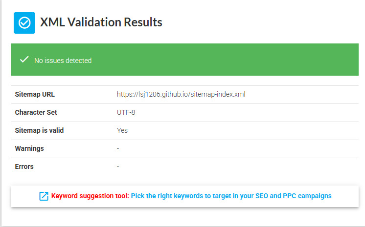

GitHub Pages 기반의 Gatsby 블로그에 SEO를 적용하는 내용을 담은 포스트입니다.
<br>
관련 플러그인 설정부터 Google Search Console을 적용하는 과정을 담았습니다.

<!-- end -->

# SEO란?

**Search Engine Optimization**, 즉 '**검색 엔진 최적화**'라는 뜻으로,
웹사이트가 구글이나 네이버 같은 검색엔진에 더 잘 노출되도록 구조와 콘텐츠를 개선하는 일련의 과정을 말합니다.

아무리 좋은 웹사이트를 개발해도 검색에 노출되지 않으면 의미가 없기에 SEO는 웹사이트에 활기를 넣어주는 역할을 합니다.

# SEO 설정하기

## 관련 플러그인 설치 및 설정

검색엔진이 내 사이트의 구조를 이해하도록 도와주는 두 가지 핵심 파일은 다음과 같습니다.

- `sitemap.xml`: 어떤 페이지들이 있는지 구조적으로 정리된 파일
- `robots.txt`: 어떤 경로는 검색엔진이 크롤링해도 되는지 여부를 지정

gatsby에 제공하는 각 파일에 대응되는 플러그인을 설치합니다.

```shell
npm install gatsby-plugin-sitemap gatsby-plugin-robots-txt
```

`gatsby-config.js`에서 설치한 플러그인을 설정합니다.

```js
module.exports = {
  siteMetadata: {
    siteUrl: `https://lsj1206.github.io`, // 사이트 도메인
    //...
  },
  plugins: [
    //...
    {
      resolve: `gatsby-plugin-sitemap`,
      options: {
        exclude: [`/404/`, `/dev-404-page/`],
      },
    },
    {
      resolve: `gatsby-plugin-robots-txt`,
      options: {
        host: `https://lsj1206.github.io`,
        sitemap: `https://lsj1206.github.io/sitemap-index.xml`,
        policy: [
          {
            userAgent: `*`,
            allow: [`/`, `/post/`],
            disallow: [`/404/`, `/dev-404-page/`],
          },
        ],
      },
    },
  ],
};
```

## SEO 태그 적용하기

`post-template.js`파일에서 **Head export**를 수정합니다.

- Gatsby v4 이상에서는 `<Head>`컴포넌트에서 `<meta>`정보를 설정할 수 있습니다.

`query`에서 가져오는 정보를 바탕으로 `<meta>`태그에 정보를 삽입

```js
export const Head = ({ data }) => {
  const post = data?.markdownRemark;
  const frontmatter = post?.frontmatter || {};
  const title = frontmatter.title || "Empty title..";
  const description = post?.excerpt || title;
  const url = `https://lsj1206.github.io/post/${post?.fields?.slug}/`;
  const image = frontmatter.coverImage?.childImageSharp?.gatsbyImageData?.images?.fallback?.src;

  return (
    <>
      <title>{title}</title>
      <link rel="canonical" href={url} />
      <meta name="description" content={description} />
      <meta name="robots" content="index, follow" />
      {/*Open Graph 메타 태그 ...*/}
      {/* Twitter Card 메타 태그 ...*/}
    </>
  );
};
```

`<meta name="description">` 태그가 존재하는데, 해당 태그는 검색 화면에서 제목 아래에 보여지면서 해당 웹사이트의 내용을 요약해주는 역할을 합니다.

해당 태그의 `content`에 본문을 삽입하게 위해 `query`를 수정하였습니다.

```js
export const query = graphql`
  query ($slug: String!) {
    markdownRemark(fields: { slug: { eq: $slug } }) {
      ...
      excerpt(pruneLength: 160)
      ...
    }
  }
`;
```

**description**태그에 어떤 데이터를 넣어야하는지에 대한 두가지 방안이 있었습니다. <br>
하나는 *frontmatter*에 **description**을 추가하고 그걸 사용하는 방안과 포스트 본문의 일부를 사용하는 방안이였습니다.

저는 *frontmatter*에서 description을 사용하지 않기도 하고, 글의 내용을 보여주는게 자연스럽다고 생각을 해서 Gatsby의 GraphQL에 내장되어 있는 `excerpt`필드를 사용하여 포스트 본문의 일부를 사용하는 방식으로 작성하였습니다.

- `excerpt`필드는 콘텐츠의 본문 중 일부를 자동으로 잘라내 요약해 문자열로 반환합니다.
  - `pruneLength`옵션으로 원하는 글자 수만큼만 잘라오도록 설정하였습니다.

```js
module.exports = {
  //...
  plugins: [
    //...
    {
      resolve: `gatsby-transformer-remark`,
      options: {
        //...
        excerpt_separator: `<!-- end -->`,
        //...
      },
    },
  ],
};
```

또한, _gatsby-transformer-remark_ 플러그인의 **excerpt_separator**옵션을 추가하여 커스텀 마커로 `excerpt`의 엔드 포인트를 지정해 이중으로 description을 가져오도록 설정했습니다. <br>


사진과 같이 Markdown본문에서 지정한 엔드포인트를 사용하면 아래의 내용은 가져오지 않습니다.

> **excerpt_separator**와 **pruneLength**를 같이 사용하는 경우, **excerpt_separator**가 1차적으로 범위를 지정하고 이후에 텍스트의 길이를 제한합니다.<br> 

추가적으로 SEO를 적용하고 싶은 다른 페이지는 별도로 해당 파일 내에서 Head export에 태그 등을 설정해야 합니다.
저는 index.js 페이지에 일부 태그를 적용했습니다.

지금까지는 Gatsby 블로그 내부에서 SEO 정보를 설정하는 내용이였습니다. <br>
이제부터는 외부에서 SEO가 잘 반영되고 있는지를 확인하는 과정을 설명하는 내용입니다.

# Google Search Console

**Google Search Console**은 구글에서 제공하는 도구로, 내 웹사이트가 검색엔진에 어떻게 인식되고 있는지, 어떤 페이지가 **검색 색인**(index)에 포함되었는지를 확인하고 관리할 수 있습니다.

## Google Search Console에 Website 등록하기

1. [Google Search Console](https://search.google.com/search-console/about)에 접속

2. 속성 유형을 선택하고 Website주소 입력하기

   *GitHub Pages*를 사용하는 경우 **URL 접두어 방식**을 사용해서 진행할 수 있습니다.
   
   | 구분 | 도메인 방식 | URL 접두어 방식 |
   | ---------------- | ---------------------------------------------- | ------------------------------------------------------------ |
   | 인증 범위 | 전체 도메인 (`www`, `http`, `https` 모두 포함) | 특정 프로토콜 + 하위 경로만 (`https://example.com/blog/` 등) |
   | 소유권 인증 방법 | DNS 레코드 설정 필요 | HTML 파일 업로드, meta 태그 등 간단한 방법 가능 |
   | 장점 | 서브도메인까지 포함하는 통합 관리 가능 | 인증과 설정이 간단하고 빠름 |
   | 단점 | DNS 접근 권한이 필요 | 동일 사이트 내 다른 경로는 별도로 등록 필요 |

3. 소유권 확인하기

   속성 유형을 선택한 뒤에는, 내가 해당 사이트의 진짜 소유자인지 구글에 증명하는 과정을 해야합니다.
   

   GSC에서는 다양한 확인 방법을 제공하고 있는데,저는 가장 간편한 방식인 **HTML 태그**를 삽입하는 방식을 선택하였습니다.
   `gatsby-ssr.js`파일에서 해당 코드를 통해 태그를 삽입했습니다.

   ```js
   export const onRenderBody = ({ setHeadComponents }) => {
     setHeadComponents([<meta name="google-site-verification" content="제공 하는 코드" />]);
   };
   ```

4. Sitemap 제출하기

   
   앞서 Gatsby 설정에서 `gatsby-plugin-sitemap` 플러그인을 사용해 sitemap파일을 자동 생성했습니다.
   이 경우 보통 다음과 같은 두 종류의 파일이 생성됩니다:

   - `sitemap-index.xml` : 여러 sitemap 파일을 묶는 목차 역할을 합니다. <br>
     이 파일 안에는 `sitemap-0.xml`, `sitemap-1.xml` 등 실제 sitemap들이 링크되어 있습니다.
   - `sitemap-0.xml` : 실제 URL들이 담긴 세부 sitemap 파일입니다. <br>
     사이트 내부의 실질적인 주소 목록이 이 파일에 기록됩니다.

   브라우저에서 https://사이트주소/sitemap-index.xml 로 접속해서 잘 열리는지 확인하고, 구조는 정상적인지 체크한뒤에 해당 주소를 **새 사이트맵 추가** 입력창에 제출하면 완료됩니다.

   저는 제출 전, 아래 사이트를 활용하여 구조를 검증했습니다. <br>
   [xml-sitemaps.com](https://www.xml-sitemaps.com/validate-xml-sitemap.html)

   

5. 제출 후 대기 시간

   사이트맵을 제출하더라도, 색인이 바로 완료되지는 않습니다.

   저는 메인페이지가 색인까지 3일정도 소요되었고, sitemap은 아직도 해결되지 않았습니다.

이렇게 Gatsby 블로그에 SEO를 적용하고, **Google Search Console**까지의 과정을 정리해봤습니다.

하지만 실제로는 색인 오류, canonical 주소 문제, sitemap 누락 등의 다양한 문제가 발생할 수 있습니다.<br>
직접 겪었던 문제들과 그 해결 과정은 다음 포스트에서 다루겠습니다.
