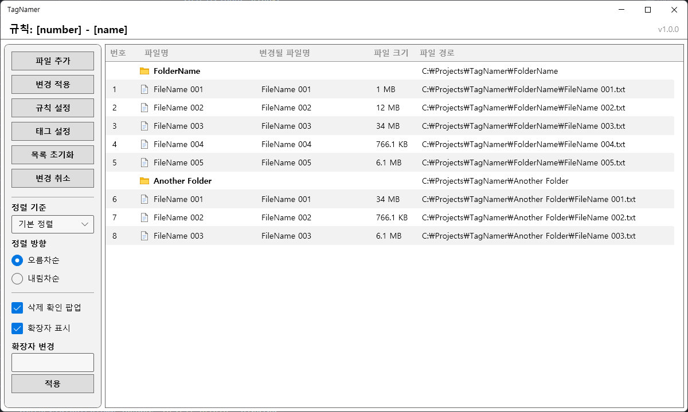
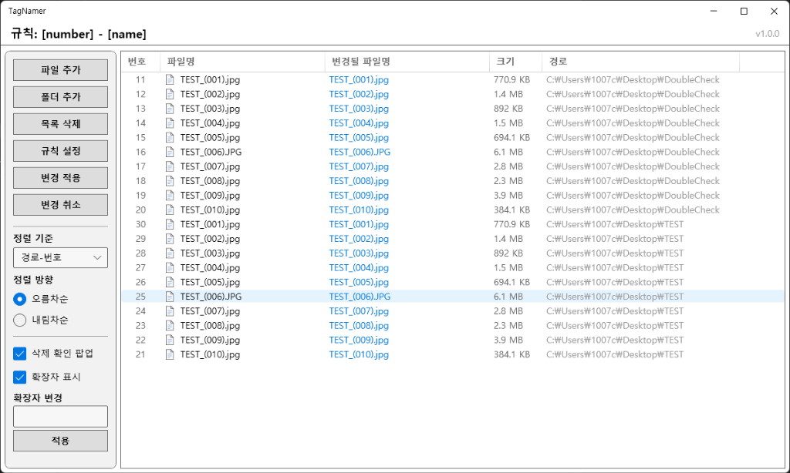

Windows에서 사용가능한 파일명 변경 프로그램인 **TagNamer**의 개발과정을 담은 첫 포스트입니다.
<br>
개발 배경과 인터페이스 설계, 파일/폴더 추가, 리스트 구현 및 정렬 기능 구현등에 대한 내용을 담고 있습니다.

<!-- end -->

# 다운로드

- [TagNamer v1.0.0 다운로드 링크](https://github.com/lsj1206/TagNamer/releases)
- 자세한 정보 : [GitHub](https://github.com/lsj1206/TagNamer)
- 라이센스 : [MIT License](https://github.com/lsj1206/TagNamer?tab=License-1-ov-file)


# 개발 배경

1. 새로 Google에서 출시된 Antigravity 사용해보기
2. 기존에 사용하던 비슷한 프로그램을 대체해서 직접 실사용할 목적

이렇게 두가지 목적에 맞춰 사용 언어로는 `C#`을 선택하고,
IDE로는 Antigravity와 보조해줄 Visual Studio를 설치한 후에 개발을 시작하게 되었습니다.

## 기획서 작성

가장먼저 간단하게 기획서를 작성했습니다.

가장 중요하게 생각했던 포인트는 두 가지로 기존 프로그램처럼 가볍고 직관적인 UI/UX 가지면서,
기존 프로그램과 차별점으로 같은 규칙을 가지는 파일들을 여러번 변경할때 효율적인 작업이 가능해야 한다는 부분이었습니다.

그래서 추가되는 리스트에 공통적으로 적용할 규칙을 설정하고, 그 규칙을 적용하는 방식으로 설계를 시작했습니다.

### 개발 목표

개발목표로 아래 7가지를 정했습니다.

1. 직관적이고 빠른 UI/UX
2. 규칙 기반 이름 변경
3. 드래그&드롭으로 파일(들) 추가 및 목록 순서 변경
4. 실시간 미리보기
5. 적용 되돌리기
6. 대용량·다량 파일 안정적 처리
7. 무설치, 포터블 구조 배포

### 핵심 기능 구조

개발 목표를 기반으로 아래와 같이 핵심 기능의 구조를 작성했습니다.

1. 파일/폴더 추가

   - 파일 선택창으로 추가
   - 드래그&드롭으로 추가

2. 파일 목록

   - 표 필수 항목: 번호, 이름, 변경될 이름, 크기, 경로

3. 이름 변경

   - 기본 Tag와 옵션이 있는 Tag 제공
   - Tag와 텍스트를 조합한 규칙 작성 (예시:`[tag1] tag2_tag3 (tag4)`)
   - 규칙 적용시 리스트 위에서부터 아래로 적용
   - 작성 규칙은 프로그램 종료 전까지 유지

4. 리스트 정렬

   - 기본 정렬 기준으로 파일 추가 순
   - 정렬 요소: 파일 추가 순, 파일 이름, 파일 생성일, 파일 수정일, 파일 크기
   - 드롭다운 + 오름차순/내림차순 버튼 제공

5. 확장자 수정
   - 확장자 표시 ON/OFF 토글
   - 확장자 변경 기능 제공

### 인터페이스 설계

마지막으로 인터페이스 설계를 하고 계획서를 마무리했습니다.

1. 헤더 (Global Navigation Bar)

   - 현재 적용 중인 규칙 표시
   - 우측 끝에 버전 표시

2. 좌측 사이드 패널

   - 파일 추가
   - 목록 초기화
   - 변경 적용/취소
   - 규칙 설정
   - 태그 설정

   * 정렬 기준/방향
   * 삭제 팝업 표시
   * 확장자 변경
   * 확장자 표시

3. 모달
   - 규칙 설정 버튼 클릭 → 모달 창 열림
   - 모달창에서 규칙 설정 과 태그 관리 진행

# 개발 과정

C# .NET 환경에서 사용가능한 다양한 UI 프레임워크들 사이에서 WPF를 선택했습니다.
다른 운영체제는 고려하지 않아 Windows에서만 잘 돌아가면 되기 때문에 `MAUI`는 제외하고, `WinForms`은 너무 구형이라 제외했습니다.

최신 Windows 디자인으로 구현할 생각이였기 때문에 마지막까지 `WinUI 3`를 고민했었는데, 포터블 exe 배포과정이 정식지원이 아니고 복잡하다고 해서 최종적으로 `WPF`에 `ModernWPF`를 사용하는 방안으로 선택했습니다.

## UI 개발

제일 먼저 아래같은 구성의 목업 UI를 구현했습니다.

- 메뉴 바
- 헤더
- 좌측 사이드 패널
- 우측 리스트
- 상태 표시줄

리스트를 구현하면서 적합한 구조를 찾아야 했습니다.

처음에는 `DataGrid` 방식으로 구현을 했습니다.


파일의 경로상 마지막 폴더를 조작이 불가능한 행으로 추가해서 같은 폴더라면 하나의 폴더 아래에 표시되고, 다른 폴더의 파일끼리는 폴더 행으로 구분감을 주는 구현을 하려는 목적이였습니다.

리스트 구현을 완성하기 위해서 실제 파일과 여러 상호작용들을 구현하고 확인하기 위해 파일 추가 기능을 구현하게 되었습니다.

## 파일 추가 개발

먼저 파일 선택창(다이얼로그)방식을 구현하고, 그 다음으로 드래그&드롭 방식을 구현했습니다.

### 파일 선택창 기능 추가

이때 파일을 추가할때 여러개의 폴더속 파일들을 한번에 추가할 수 있도록 구현하고 싶었습니다.

윈도우 표준 다이얼로그는 파일을 선택하는 창에서는 폴더를 선택할 수 없고, 폴더를 선택하는 창에서는 파일을 개별적으로 고를 수 없었습니다.

그래서 WindowsAPICodePack, Ookii.Dialogs.Wpf 등을 사용해서 시도를 해봤지만 결국 이 라이브러리들도 불가능했고 남은 선택지가 표준 기능이 아니였기 때문에 구현을 포기하고 `Microsoft-WindowsAPICodePack-Shell`를 사용해서 파일 추가와 폴더 추가로 분리해서 구현했습니다.

### Drag&Drop 파일 추가 개발

파일 선택창 방식을 추가했지만, 이전에 사용하던 프로그램에서 파일을 추가할때 가장 많이 사용했던 방식은 Drag&Drop 방식이였고, Drag&Drop 방식이 더 편리하고 기본적으로 지원해야하는 기능이라고 생각했습니다.

그래서 WPF에서 기본적으로 지원하는 기능에 Drop 이벤트로 들어온 데이터를 파일인지 폴더인지 구별해서 별개로 동작하는 로직을 작성했습니다.

## 리스트 순서 변경 기능 개발

Drag&Drop으로 파일 추가 기능을 개발한 김에 이어서 Drag&Drop으로 리스트 순서를 변경하는 기능을 개발하려고 했습니다.

필수로 구현하려고 했던 기능은 두가지 입니다.

1. 다중 선택
   - Ctrl + 클릭으로 다중 선택
   - Shift + 클릭으로 범위 선택
   - 드래그 상태에서 자동 스크롤
2. 드롭 위치에 대한 정확한 시각화

### 다중 선택 구현

여러개의 파일을 Drag&Drop하는 기능은 쉽게 구현했지만,계속해서 Drag당시 선택한 항목만 Drop되고 다른 항목은 이동되지 않는 문제가 발생했습니다.

코드 흐름이나 구조상으로는 문제가 없는데 AI도 원인을 찾지 못하고 있었기 때문에 AI에게 다른 관점에서 접근해달라고 요청했습니다.
그래서 WPF의 기본 동작과 충돌한다는것을 알게 되었습니다.

WPF 내부 로직이 마우스 클릭 시점에 다른 선택을 해제해 버리는데, 시각적으로는 남아서 여러개가 선택된걸로 보이고 실제로는 하나만 선택되어있는 문제였습니다.

그래서 이벤트를 가로채서 WPF 기본 로직이 작동하는걸 막는 방식으로 다중 선택을 구현했습니다.

```csharp
private void FileListView_PreviewMouseLeftButtonDown(object sender, MouseButtonEventArgs e)
{
    _startPoint = e.GetPosition(null);
    _isPotentialDrag = false;

    ListViewItem? listViewItem = FindAnchestor<ListViewItem>((DependencyObject)e.OriginalSource);
    if (listViewItem != null && listViewItem.IsSelected)
    {
        // 더블 클릭일 때는 이벤트를 가로채지 않습니다.
        if (e.ClickCount >= 2) return;

        // 이미 선택된 항목을 클릭한 경우 WPF의 기본 동작을 방지하기 위해 처리
        _isPotentialDrag = true;
        e.Handled = true;
    }
}
```

> `PreviewMouseLeftButtonDown`에서 클릭된 항목이 이미 선택된 상태라면, WPF가 이벤트를 처리하지 못하도록 `e.Handled = true`를 선언

이벤트를 막아버리면 드래그는 되지만, 단일 아이템을 선택하고 싶을 때의 동작이 망가지게됩니다.
이를 해결하기 위해 **마우스를 뗄 때**의 로직을 별도로 설계했습니다.

```csharp
private void FileListView_PreviewMouseLeftButtonUp(object sender, MouseButtonEventArgs e)
{
    if (_isPotentialDrag && sender is ListView listView)
    {
        ListViewItem? listViewItem = FindAnchestor<ListViewItem>((DependencyObject)e.OriginalSource);
        if (listViewItem != null)
        {
            // 드래그가 발생하지 않고 버튼을 뗐다면, 마우스 이벤트가 핸들링되어 선택이 안 바뀌었으므로
            // 여기서 수동으로 클릭한 하나만 선택되게 함 (WPF 기본 동작 재현)
            var item = listView.ItemContainerGenerator.ItemFromContainer(listViewItem);
            listView.SelectedItems.Clear();
            listView.SelectedItems.Add(item);
        }
    }
    _isPotentialDrag = false;
}

private void FileListView_MouseMove(object sender, MouseEventArgs e)
{
    if (e.LeftButton == MouseButtonState.Pressed && sender is ListView listView)
    {
        Point mousePos = e.GetPosition(null);
        Vector diff = _startPoint - mousePos;

        // 일정 거리 이상 움직였을 때만 드래그 시작
        if (Math.Abs(diff.X) > SystemParameters.MinimumHorizontalDragDistance ||
            Math.Abs(diff.Y) > SystemParameters.MinimumVerticalDragDistance)
        {
            ListViewItem? listViewItem = FindAnchestor<ListViewItem>((DependencyObject)e.OriginalSource);

            if (listViewItem != null)
            {
                // 클릭한 아이템이 이미 선택되어 있다면 선택된 모든 항목을 이동 대상으로 함
                var selectedItems = listView.SelectedItems.Cast<TagNamer.Models.FileItem>().ToList();
                var clickedItem = listView.ItemContainerGenerator.ItemFromContainer(listViewItem) as TagNamer.Models.FileItem;

                // 만약 단일 클릭 후 바로 드래그 중이라면 해당 아이템만 대상으로 함
                if (clickedItem != null && !selectedItems.Contains(clickedItem))
                {
                    selectedItems = new System.Collections.Generic.List<TagNamer.Models.FileItem> { clickedItem };
                }

                if (selectedItems.Count > 0)
                {
                    _isPotentialDrag = false;
                    var dragData = new DataObject("InternalMove", selectedItems);
                    DragDrop.DoDragDrop(listViewItem, dragData, DragDropEffects.Move);
                }
            }
        }
    }
```

> 드래그 상황: 마우스 이동 거리가 일정 수준(`SystemParameters.MinimumHorizontalDragDistance`)을 넘으면, 현재 선택된 모든 항목을 데이터에 담아 드래그를 시작

> 단순 클릭 상황 : 마우스 이동이 없었다면 드래그가 아닌 것으로 판단하고 수동으로 해당 항목만 선택

그리고 목록이 길어 Drag한 위치와 Drop하는 위치가 멀 경우를 대비하여 리스트의 상/하단에 닿을경우에 **자동 스크롤** 기능을 구현했습니다.

```csharp
private void HandleAutoScroll(DragEventArgs e)
{
    var scrollViewer = FindChild<ScrollViewer>(FileListView); // FileListView 내부의 ScrollViewer 찾기
    if (scrollViewer == null) return;

    double tolerance = 30; // 스크롤을 감지할 상/하단 너비
    Point position = e.GetPosition(FileListView);

    if (position.Y < tolerance)
    {
        // 상단 영역에 있으면 위로 스크롤 (이동속도: 2)
        scrollViewer.ScrollToVerticalOffset(scrollViewer.VerticalOffset - 2);
    }
    else if (position.Y > FileListView.ActualHeight - tolerance)
    {
        // 하단 영역에 있으면 아래로 스크롤 (이동속도: 2)
        scrollViewer.ScrollToVerticalOffset(scrollViewer.VerticalOffset + 2);
    }
}
```

> PreviewDragOver 이벤트에서 마우스의 Y좌표를 계산하고 리스트 상/하단 30px 영역을 '스크롤 구간'으로 정의하고 마우스가 이 구간에 머물면 스크롤이 작동

### 리스트 구조 변경

Drag&Drop으로 순서 변경 기능과 드롭 위치에 대한 인디케이터를 구현하는 과정에서 `DataGrid` 구조가
순서 변경이 복잡하고 인디케이터를 넣기에 너무 경직된 구조여서 변경할 필요성을 느껴 `ListView + GridView`로 구조를 전환했습니다.

또한, 기존의 폴더 행으로 구분감을 주는 표현이 리스트 구현 난이도를 너무 어렵게 하면서 순서 변경과 충돌하는 난해한 부분들도 많았습니다.

예를 들면,

- Drop 위치가 폴더 행이라면?
- 순서를 변경하는데 Drag위치와 Drop위치가 다른 폴더라면 어떻게 동작할것인가?

이런 여러가지 애매한 부분들이 있었고 해결방법들이 아쉬운 부분들이 많아서 오히려 UX적인 측면에서 마이너스 요소라고 판단하게되어 수정을 했습니다.



초기 기획에서는 폴더를 구분하는 UI의 역할로만 보고있었는데, 그 역할을 수정하면서 간과하고있던 폴더도 하나의 이름 변경 대상이라는걸 깨달아

폴더 추가 버튼으로 폴더를 추가할떄 내부 파일을 추가할껀지, 폴더 자체를 추가할껀지 묻는 다이얼로그를 추가하고 기존엔 파일만 번호를 부여하는 기획을 수정해서 폴더 또한 파일과 동일하게 취급하는 방식으로 변경하였습니다.


## 리스트 자동 정렬 기능

리스트 자동 정렬 부분의 경우에는 기존에 사용하던 프로그램에서 불편함이 있던 부분 중 하나였기에 기획단계부터 어느정도 틀을 잡아놓은 상황이였습니다.

1. 리스트의 기본 정렬은 목록에 추가되는 순서대로 정렬

   - 리스트의 번호 항목이 추가되는 순서로 부여받는 구조로 설계해둠

2. 동시에 여러 파일이 추가되는 경우에는 이름순서대로 추가

   - 정렬 기준을 1차 2차로 두어 최대한 사용자가 편리하도록 설계

3. 2번 상황에서 이름에 숫자가 있고 자리 수가 다를때 첫 자리수만 비교하는게 아니라 1 다음 2 9 다음 10 99다음 100이 오도록 설계

   - 이 문제는 수동으로 정렬을 해야하는 불편함이 있고 해당 문제를 인지하지 못하고 일괄적으로 이름을 변경하게되면 파일의 순서가 섞여버림

4. 사용자가 Drag&Drop으로 수동으로 순서를 변경한 것을 고정시킬수 있는 기능 필요
   - 리스트 항목의 번호가 해당 역할도 하도록 번호 재정렬할 수 있는 기능 추가

기획 단계와 UI 설계 단계에서 드롭다운 메뉴에 오름차/내림차 순 버튼을 사용하고,
드롭다운 메뉴의 항목에는 추가, 이름, 생성일, 수정일, 크기가 들어간다는걸 설계를 해두었지만,
시작하기에 앞서 정렬 옵션을 좀 더 디테일하게 설정을 해야 했습니다.

추가 순서에 따라 번호를 지정하고 번호를 변경하게 설계할 예정이기 때문에 추가 순을 번호 순으로 변경하고 가장 상단에 두고 기본값으로 설정했습니다.

폴더 별로 볼 수 있게 경로 순 옵션을 추가했습니다.
그리고 이름, 경로 옵션은 동일한 케이스가 빈번하게 있기 때문에 2차 정렬 기준으로 번호,경로 순으로 까지 선택해서 정렬가능하도록 설계했습니다.

> 안정성을 위해 크기, 생성일, 수정일의 2차 정렬 기준은 번호순으로 설정해두었습니다.

최종적으로 8개의 옵션을 제공하는 드롭다운 메뉴를 구현하였습니다.

- 번호
- 이름-번호,경로
- 경로-번호,이름
- 크기
- 생성일
- 수정일

> 리스트 헤더를 클릭해서 정렬하는 기능은 의도적으로 제외했습니다. <br> 클릭 실수로 인해 정렬이 변경되는 불편함을 예방하는게 더 좋은 UX를 제공할 것이라 판단했습니다.

```csharp
public IEnumerable<FileItem> Sort(IEnumerable<FileItem> items, SortOption option, bool isAscending)
{
    //...
    // 1차 정렬: 사용자가 선택한 주 정렬 기준
    switch (option.Type)
    {
        case SortType.NameNumber:
        case SortType.NamePath:
            // 윈도우 탐색기 방식의 자연스러운 정렬(숫자 인식 등) 적용
            sortedItems = isAscending
                ? itemList.OrderBy(x => x.BaseName, _naturalComparer)
                : itemList.OrderByDescending(x => x.BaseName, _naturalComparer);
            break;
		//...
    }
    // 2차 정렬: 1차 기준이 같을 때 적용되는 보조 정렬 기준
    switch (option.Type)
    {
		//...
        case SortType.ModifiedDate:
            // 대부분의 경우 중복 시 번호(AddIndex) 순으로 정렬하여 일관성 유지
            sortedItems = isAscending
                ? sortedItems.ThenBy(x => x.AddIndex)
                : sortedItems.ThenByDescending(x => x.AddIndex);
            break;
		//...
    }
    return sortedItems;
}

```

> **LINQ**를 사용하여 로직을 구현했습니다.

### Windows 11 스타일 고급 정렬

기획 단계부터 Windows 11 탐색기와 정렬 방식을 동일하게 구현하는걸 목표로 했었는데,
윈도우 시스템 API를 사용하는 방식으로 간편하게 구현할 수 있었습니다.

```csharp
public class WindowsNaturalComparer : IComparer<string>
{
    [DllImport("shlwapi.dll", CharSet = CharSet.Unicode)]
    private static extern int StrCmpLogicalW(string psz1, string psz2);

    public int Compare(string? x, string? y)
    {
        if (x == null && y == null) return 0;
        if (x == null) return -1;
        if (y == null) return 1;

        return StrCmpLogicalW(x, y);
    }
}
```

> Windows의 `shlwapi.dll` 라이브러리에서 논리적 문자열 비교(`StrCmpLogicalW`) 함수를 가져옵니다.

**번호 재정렬 기능**
Drag&Drop으로 사용자가 변경한 리스트의 항목을 유지시켜주는 기능을 제공하기위해 기존의 파일의 추가순서였던 `AddIndex`(번호)를 재사용하는게 좋겠다는 생각이 들어서 사용자가 임의로 변경한 순서를 고정시켜줄 수 있는 번호 재정렬 기능을 구현하였습니다.

---

지금까지 TagNamer의 기본적인 UI와 리스트 및 리스트와 연관된 기능을 구현하는 과정을 정리하였습니다.
<br>
이어지는 다음 포스트에서는 태그를 사용한 이름 변경 시스템과 태그 시스템, 보조 기능과 최적화에 대해서 다룰 예정입니다.
