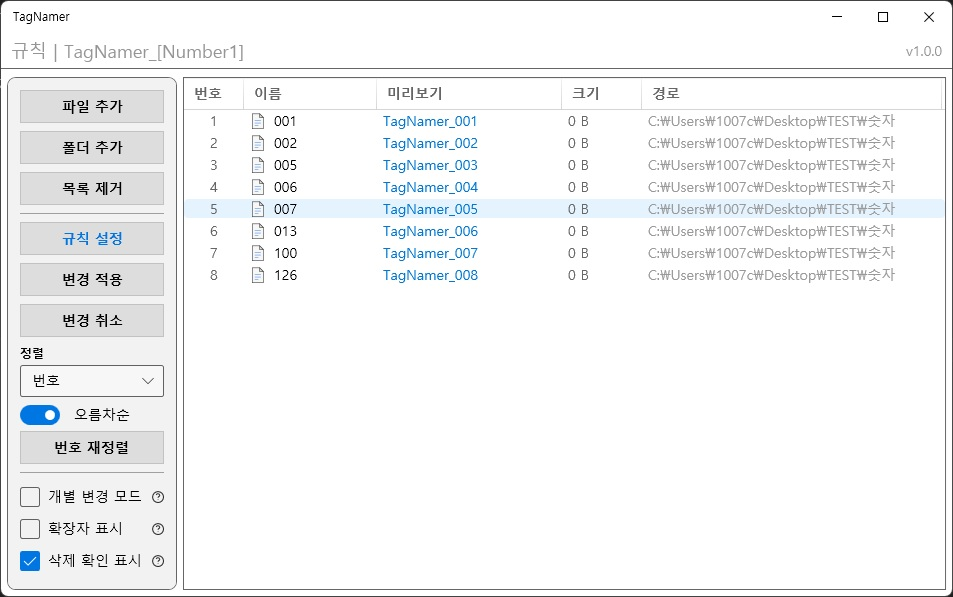
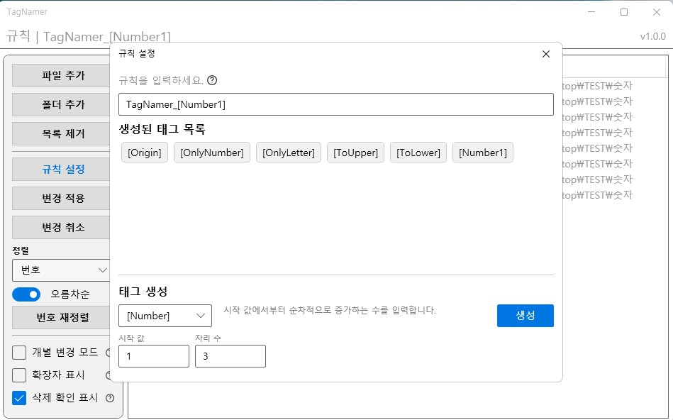
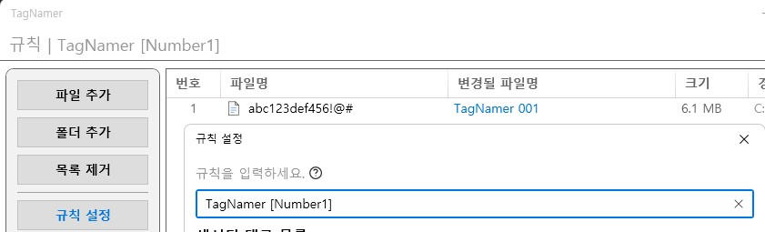
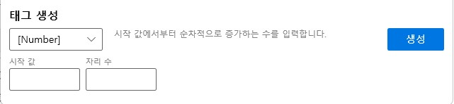
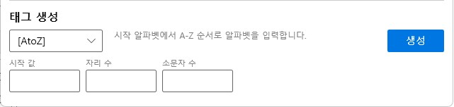
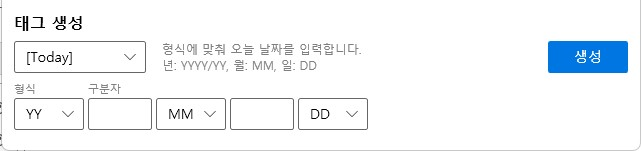
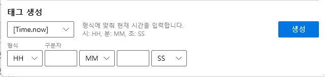
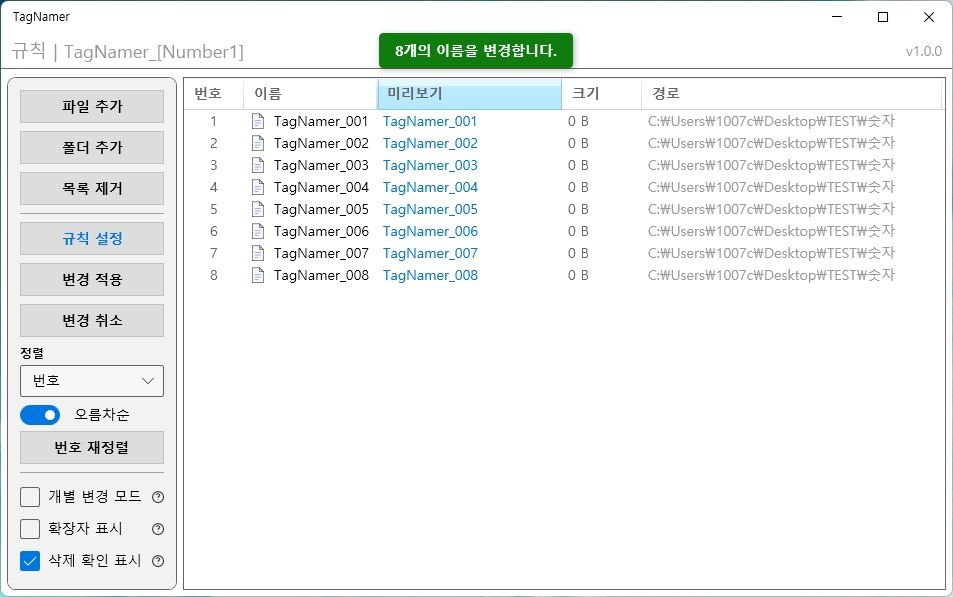

Windows에서 사용가능한 파일명 변경 프로그램인 **TagNamer**의 개발과정을 담은 두 번째 포스트입니다.
<br>
태그를 사용한 이름 변경 시스템과 태그 시스템, 보조 기능과 최적화에 대해서 정리했습니다.

<!-- end -->

# 다운로드
- [TagNamer v1.0.0 다운로드 링크](https://github.com/lsj1206/TagNamer/releases/tag/v1.0.0)
- 자세한 정보 : [GitHub](https://github.com/lsj1206/TagNamer)
- 라이센스 : [MIT License](https://github.com/lsj1206/TagNamer?tab=License-1-ov-file)



### 들어가기에 앞서

1부는 대략적인 시간 순서에 따라 리스트와 UI의 변천사를 다루었지만, 2부는 **'태그 시스템'**을 중심으로 연계되는 기능에 초점을 맞춰 정리했습니다.

# 규칙 설정 화면 구성

복잡한 규칙 설정과 태그 관리를 메인 화면에 모두 넣으면 UI가 너무 산만해질 우려가 있었습니다.
그래서 '규칙 설정'은 별도의 윈도우(`RenameWindow`)로 분리하여 집중할 수 있는 환경을 만들었습니다.

**화면 구성**
- **상단 (Rule Input)**: 규칙과 태그를 입력하는 `FilterTextBox`를 배치했습니다.
- **중단 (Tag List)**: 사용가능한 태그 목록을 보여주며, 우클릭을 통해 컨텍스트 메뉴를 호출할 수 있습니다.
- **하단 (Tag Creation)**: 옵션 태그를 생성하는 영역입니다. 선택한 태그 타입에 따라 필요한 옵션 입력 UI가 동적으로 바뀝니다.



## 규칙 텍스트 박스

규칙 텍스트 박스는 사용자가 파일명을 변경할 규칙을 입력하는 핵심 컨트롤입니다.
단순한 텍스트 입력뿐만 아니라, `[Tag]` 형태의 태그를 삽입하여 동적인 이름 변경을 지원합니다.

사용자가 텍스트를 입력하면 실시간으로 미리보기(Preview)에 반영됩니다.



## 태그 시스템 설계
기존에 사용하던 프로그램은 하나의 목록을 한 두번 변경하기엔 효율적인 구조지만, 여러 개의 파일목록을 다룰때에는 비효율적 부분이 존재했습니다.

기획단계에서 여러개의 목록을 다룰때 효율적인 구조를 생각하다 정규식을 떠올렸지만 정규식은 복잡하고 직관적이지 않아 비슷하면서 더 직관적이고 효율적인 시스템으로 태그를 생각하게 되었습니다.

태그는 세가지 종류로 구성됩니다.
1. 기본태그
    - 특별한 옵션이 없어 사용만 하면 되는 태그
2. Unique 속성을 가지는 기본태그
    - 위치와 상관없이 작동하고 규칙 전체에 동작하는 기본태그
3. 옵션태그
    - 옵션이 있어 사용자가 커스텀해서 사용하는 태그

`MVVM` 구조의 모델로 `TagItem`을 구현하고 기본태그와 옵션태그 모두 `TagItem`을 상속받지만,
- 기본 태그는 처음부터 하드코딩으로 태그 리스트에 생성
- 옵션 태그는 사용자가 옵션을 설정후 생성하면 태그 리스트에 [태그이름+번호] 형태로 추가

하는 구조로 설계했습니다.

### [Number], [AtoZ] 태그 개발

[Number]와 [AtoZ] 태그는 가장 기본이라고 볼 수 있는 번호 매기기 로직으로 작동하는 태그입니다.

두 태그 공통적으로, 시작 값과 자리 수가 옵션이고 [AtoZ] 태그는 소문자 수라는 옵션도 추가했습니다.

#### FilterTextBox 구현
자리 수 옵션이나 소문자 수 옵션은 숫자만 유효하고, [Number] 태그의 시작 값은 숫자만, [AtoZ] 태그는 알파벳만 유효합니다.
나머지 문자들은 예외처리를 해야하는데 입력을 받고 처리하는것보다 더 효율적 UI 입력 단계에서 차단을 하고싶었습니다.

기본적인 구조에서는 차단하는 방법은 간단했지만 텍스트박스에 입력자체가 안되다보니 UX적으로 별로라고 생각해서 어떤 문자들이 입력이 가능한건지 알려주는 UX가 필요했습니다.

그런데 툴팁을 사용하자니 직관적으로 알려준다는 생각이 들지 않아서 입력은 되지만 차단되는 문자는 입력즉시 삭제하는 UX를 구현하고 싶어서 `FilterTextBox`를 구현했습니다.

```csharp
private void OnTextChanged(object sender, TextChangedEventArgs e)
{
    if (_isFiltering) return;

    _isFiltering = true;

    // 딜레이를 사용해서 입력불가를 UX로 표현 (깜빡이는 듯한 효과)
    Dispatcher.BeginInvoke(() =>
    {
        try
        {
            ApplyFilter();
        }
        finally
        {
            _isFiltering = false;
        }
    }, System.Windows.Threading.DispatcherPriority.Background);
}
```
> 텍스트가 변경될 때마다(`OnTextChanged`) 비동기(`Dispatcher.BeginInvoke`)로 필터링 로직을 수행합니다.

이렇게 하면 사용자가 잘못된 문자를 입력했을 때, **문자가 잠시 나타났다가 사라지는 시각적 효과**를 줄 수 있어 "입력이 거부되었다"는 느낌을 직관적으로 전달할 수 있습니다.

또한 단순히 하드코딩된 필터링이 아니라, `Enum`을 활용해 재사용 가능한 구조의 필터를 구현했습니다.
`Filter` 열거형으로 문자 집합을 정의하고, `FilterMode`로 이를 허용할지(Allow/Whitelist) 차단할지(Block/Blacklist) 결정합니다.

```csharp
public enum Filter
{
    None,           // 필터 사용 안 함
    ValidSpecial,   // Windows 파일명 허용 특수문자
    InvalidSpecial, // Windows 파일명 금지 특수문자 (< > : " / \ | ? *)
    Digits,         // 숫자 (0-9)
    Alpha,          // 영문자
}

public enum FilterMode
{
    Allow, // 해당 문자들만 입력 가능
    Block  // 해당 문자들은 입력 불가
}

// FilterTextBox.cs 내부
private static void OnFilterChanged(DependencyObject d, DependencyPropertyChangedEventArgs e)
{
    // ...
    string? characterSet = GetCharacterSet(filter); // Enum에 따라 문자열 반환

    if (mode == FilterMode.Allow)
    {
        textBox.AllowedCharacters = characterSet;
        textBox.BlockedCharacters = null;
    }
    else // FilterMode.Block
    {
        textBox.AllowedCharacters = null;
        textBox.BlockedCharacters = characterSet;
    }
}
```

규칙 텍스트 박스도 `FilterTextBox`로 교체하고 Windows 파일명에서 사용 불가능한 특수문자 (< > : " / \ | ? *)를 차단해서 예외처리했습니다.




#### 시작 값과 자리 수 옵션의 예외처리

윈도우에서 파일명의 최대 길이는 확장자 포함 255자입니다.
그래서 자리 수 옵션과 소문자 수 옵션의 최대값을 100로 제한했습니다.

개발 중 `TextBox`의 값이 바인딩된 속성에 즉시 업데이트되지 않아 발생한 버그가 있었습니다.
예를 들어, 사용자가 자리 수에 '3'을 입력하고 포커스를 옮기지 않은 채 바로 [생성] 버튼을 누르면, ViewModel에 예외처리로 적용된 최소값(0 또는 1)이 전달되어 '001'이 아닌 '1'로 태그가 생성되는 문제였습니다.

처음에는 View 단계에서 `UpdateSourceTrigger=PropertyChanged`를 사용하여 입력을 할 때마다 즉시 바인딩을 업데이트하도록 해결했습니다.

하지만 이 방식은 입력 중간 단계의 불완전한 값까지 검증 로직을 태우게 되어 불필요한 오버헤드가 발생하거나, `FilterTextBox`의 UX를 제공할 수 없었습니다.

최종적으로는 `FilterTextBox` 내부 로직에서 포커스를 잃거나 특정 이벤트 시점에서 강제로 `BindingExpression.UpdateSource()`를 호출하여, 버튼 클릭 시점에는 확실하게 데이터가 동기화되도록 수정했습니다.

### [Today], [Time.now] 태그 개발

날짜와 시간을 입력하는 태그입니다. 사용자가 원하는 포맷(예: `YYYY-MM-DD`, `YY.MM.DD` 등)을 자유롭게 구성할 수 있어야 했습니다.

처음에는 드롭다운 메뉴와 텍스트 박스를 교차 배치했습니다.
- 구성: `[드롭다운1]` `[구분자1]` `[드롭다운2]` `[구분자2]` `[드롭다운3]`
- 예: `YYYY` `-` `MM` `-` `DD` -> "2026-01-17"

그리고 유연성을 주기위해 드롭다운에 미선택 상태를 추가해서 DDYY-MM, MMYY 이렇게 다양한 순서배치와 조합을 사용할 수 있도록 했습니다.




### [ToUpper], [ToLower] 태그 개발

파일명의 포함된 알파벳의 대소문자를 일괄 변경하는 태그입니다.
위치와 상관없이 동작하며, 변환작업에서 다른 태그보다 나중에 동작해서 다른 태그로 생성된 알파벳도 변환하게 됩니다.
또한 이 태그들은 규칙에 여러개가 존재할 필요가 없기때문에 가시성을 위해서 규칙에 하나만 존재하도록 설계했습니다.

#### 이중 변환(SafeRename) 구현
Windows 파일 시스템(NTFS)은 대소문자를 구분하지 않습니다(Case-insensitive).
그래서 `image.png`를 `IMAGE.PNG`로 이름을 바꾸려고 시도하면, 윈도우는 해당 이름 변경을 수행하지 않습니다.

이를 해결하기 위해 **이중 변환(SafeRename)** 로직을 구현했습니다.

```csharp
private void SafeRename(string sourcePath, string destPath)
{
    if (string.IsNullOrEmpty(sourcePath) || string.IsNullOrEmpty(destPath)) return;
    if (sourcePath == destPath) return;

    // 대소문자만 다른 경우 (Case-only rename)
    bool isCaseOnlyChange = string.Equals(sourcePath, destPath, StringComparison.OrdinalIgnoreCase) &&
                            !string.Equals(sourcePath, destPath, StringComparison.Ordinal);

    if (isCaseOnlyChange)
    {
        // 임시 파일명으로 변경 후 최종 이름으로 변경
        string tempPath = sourcePath + ".tmp_" + Environment.TickCount64.ToString("X");
        _fileService.RenameFile(sourcePath, tempPath);
        _fileService.RenameFile(tempPath, destPath);
    }
    else
    {
        _fileService.RenameFile(sourcePath, destPath);
    }
}
```
> 대소문자만 변경되는 경우인지 확인(`isCaseOnlyChange`)하고, 맞다면 중간에 임시 파일명을 거치도록 하여 파일 시스템이 변경 사항을 인식하도록 만들었습니다.

### [OnlyNumber], [OnlyLetter] 태그 개발

이 태그들은 파일명에서 특정 문자만 남기거나 제거하는 '필터' 역할을 수행합니다.

이 태그들도 [ToUpper], [ToLower] 태그처럼 서로 규칙에 동시에 존재하면 안되기 때문에 같은 로직을 적용시켰습니다.

문제는 [OnlyNumber]와 [OnlyLetter]가 [ToUpper]/[ToLower] 태그와의 상호작용이 서로 다르다는 것이였습니다.<br>
[OnlyNumber]와 [OnlyLetter]를 동시에 쓰면 아무것도 남지않기때문에 절대 같이 사용할 수 없게 해야 했습니다.
그리고,  [OnlyNumber]는 [ToUpper],[ToLower]가 규칙에서 필요 없어지는데, [OnlyLetter]는 [ToUpper],[ToLower] 같이 동작하는게 가능합니다.

#### 배타적 속성 도입

[ToUpper]와 [ToLower]를 먼저 개발했고 그때는 복잡한 상호작용이 없었기 때문에 로직 자체가 단순했습니다.
그러나 [OnlyNumber]와 [OnlyLetter]가 추가되면서 상호작용이 복잡해져 로직은 변경해야했습니다.

그래서 `TagItem` 모델에 두 가지 속성을 추가했습니다.

```csharp
public class TagItem
{
    // ...
    public bool IsUnique { get; set; }           // 중복 추가 불가 (예: [ToUpper]는 하나만 있으면 됨)
    public string ExclusiveGroup { get; set; }   // 배타적 그룹 (예: "FilterGroup")
}
```
> `IsUnique`는 규칙 내에 해당 태그가 하나만 존재하도록 보장

> `ExclusiveGroup`은 그룹 별로 묶어 배타적으로 밀어낼 수 있도록 보장

#### 베타적 그룹 로직 구현
베타적 그룹 속성에 맞춰 규칙 내에 같은 그룹의 태그가 추가되면 검증하는 구조입니다.

```csharp
partial void OnRuleFormatChanged(string? oldValue, string newValue)
{
    // ...
    // 2. ExclusiveGroup 태그 상호 배타성 처리
    var groupedTags = TagManager.CreatedTags
        .Where(t => !string.IsNullOrEmpty(t.ExclusiveGroup))
        .ToList();

    foreach (var group in groupedTags)
    {
        var presentTags = tagsInGroup
            .Where(t => cleaned.IndexOf(t.TagName, StringComparison.OrdinalIgnoreCase) >= 0)
            .ToList();

        if (presentTags.Count > 1) // 같은 그룹 태그가 2개 이상이면
        {
             // 새로 입력된(oldValue에는 없었던) 태그를 찾아서 유지
            TagItem? preserveTag = null;
            if (!string.IsNullOrEmpty(oldValue))
            {
                preserveTag = presentTags.FirstOrDefault(t =>
                    oldValue.IndexOf(t.TagName, StringComparison.OrdinalIgnoreCase) < 0);
            }
            // ... 찾은 태그(preserveTag)를 제외한 나머지 배타적 태그들을 제거 ...
        }
    }
}
```
사용자 경험상 **"마지막으로 추가한 태그"**를 남기는게 좋을것이라 판단해서 `oldValue`와 `newValue`를 통해 마지막 태그가 밀어내도록 구현했습니다.
예를 들어 `[OnlyLetter]`와 `[ToUpper]`가 있는 상태에서 `[OnlyNumber]`를 입력하면 `[OnlyNumber]`만 남게됩니다.

### [Name.trim] 태그 개발

파일명의 특정 부분을 잘라내거나 남기는 기능을 담당하는 태그입니다.

**UI 구성**
- **시작/끝 입력** : 문자의 인덱스를 지정하는 숫자 입력 필드 (1부터 시작)
- **방향 토글** : [앞에서] / [뒤에서]
- **동작 토글** : [삭제] (선택 범위 제거) / [남기기] (선택 범위만 유지)

```csharp
case TagType.NameTrim:
    if (tag.Params is NameTrimTagParams splitP)
    {
        // 1. 방향(앞/뒤)에 따라 실제 시작/끝 인덱스 계산
        int startIndex, endIndex;
        if (splitP.IsFromBack)
        {
            endIndex = length - start;
            startIndex = length - end;
        }
        else
        {
            startIndex = start - 1; // 1-based -> 0-based
            endIndex = end - 1;
        }

        // 2. 인덱스 유효성 보정
        if (startIndex < 0) startIndex = 0;
        if (endIndex >= length) endIndex = length - 1;

        // 3. 잘못된 범위 처리 (교차되거나 범위 밖)
        if (startIndex > endIndex || startIndex >= length || endIndex < 0)
        {
            // 삭제 모드면 원본 유지, 남기기 모드면 빈 문자열 반환
            replacement = splitP.IsKeep ? "" : name;
        }
        else
        {
            // 4. 동작 수행
            if (splitP.IsKeep)
                replacement = name.Substring(startIndex, endIndex - startIndex + 1);
            else
                replacement = name.Remove(startIndex, endIndex - startIndex + 1);
        }
    }
    break;
```
이렇게 함으로써, `[Name.trim]` 태그 하나로 "확장자 앞 3글자 지우기", "파일명 맨 앞 4글자만 남기기" 등 다양한 패턴을 모두 커버할 수 있게 되었습니다.


# 개별 변경 모드 개발

일괄 변경 규칙을 사용하면서도 특정 파일만 예외적으로 수정이 필요한 경우가 있습니다.
이를 위해 **개별 변경 모드**를 구현했습니다.

### 기획 및 동작 로직

사이드바에서 "개별 변경 모드" 옵션을 활성화하고 리스트에서 수정하고싶은 항목을 *더블 클릭*하면 해당 항목의 '미리보기' 필드가 `TextBox`로 변환되어 개별 변경 화면을 띄웁니다.

#### 규칙 기반 변경과 개별 변경이 병행될 때

**규칙 우선**: 사용자가 상단 규칙 텍스트 박스를 수정하면, 개별 변경된 내용이 초기화되고 일괄 규칙이 다시 적용됩니다. (일괄 적용의 편의성 보장)
**개별 우선**: 규칙이 적용된 상태에서 개별 파일을 수정하면, 그 파일만 수동 입력된 이름을 유지하고 나머지 파일들은 여전히 규칙을 따릅니다.

수동 입력창을 내용을 모두 지우면, 이름 변경 대상에서 제외하는 것으로 간주하거나 원래 이름으로 되돌립니다.


# 스낵바 UI 구현 및 예외처리

1000개 이하의 파일을 처리할때는 상관없지만, 그 이상의 파일을 변경하는데는 어느정도 시간이 소요됩니다.
이때 작업이 진행중이라는 걸 알려주는 UI가 필요했습니다.

기존에 예외처리에 대한 UI로 MessageBox를 사용하고 있었는데, 통합해서 표현할 UI를 고민하다가 스낵바를 도입하게 되었습니다.

- **성공(초록)**: "N개의 이름 변경 완료"
- **경고(노랑)**: "10개 중 8개 성공, 2개 실패" (일부 실패 시)
- **실패(빨강)**: "이름 변경 실패" (치명적 오류)

특히 대량 작업은 비동기(`async/await`)로 처리되므로, 작업이 끝난 후 UI 스레드(`Dispatcher`)로 복귀하여 안전하게 스낵바를 띄우는 구조로 개발했습니다. 이를 통해 사용자는 작업을 방해받지 않으면서도 결과를 명확히 인지할 수 있게 되었습니다.



# 다량의 파일을 위한 구조 변경 및 최적화

수만 개의 파일을 처리할 때 UI가 멈추거나(Freezing) 미리보기가 느려지는 문제가 발생했습니다.

### 대량 추가 시 중복 검사 최적화
파일을 목록에 추가할 때마다 전체 리스트를 순회하며 중복을 확인하는건 리스트가 커질수록 속도가 급격히 느려집니다.(대략 O(N²))

이를 해결하기 위해 `HashSet`을 도입하여 중복 검사를 **O(1)**로 처리하는 `AddRange` 메서드를 구현했습니다.
WPF `ObservableCollection`의 특성상 아이템 추가 시마다 UI 알림이 발생하지만, 가장 큰 병목 구간인 중복 검사 로직을 최적화하는 것만으로도 5만 개 이상의 파일을 끊김 없이 목록에 담을 수 있게 되었습니다.

```csharp
public int AddRange(IEnumerable<FileItem> newItems)
{
    int addedCount = 0;
    foreach (var item in newItems)
    {
        if (!_pathSet.Contains(item.Path))
        {
            item.AddIndex = _nextAddIndex++;
            Items.Add(item);
            _pathSet.Add(item.Path);
            addedCount++;
        }
    }
    return addedCount;
}
```
> WPF의 `ObservableCollection`은 `AddRange`가 없으므로 순회하며 추가하되, 대량 추가 시의 중복 체크 성능을 보장합니다.

### 정규식(Regex) 제거
초기에는 태그 패턴 매칭(`[Number]`, `[Today]` 등)을 모두 정규식(`Regex`)으로 처리했습니다.

하지만 정규식 엔진은 복잡한 패턴 매칭을 위해 백트래킹 등을 수행하므로, 최악의 경우 **O(2^N)**에 가까운 성능 저하가 발생할 수 있습니다.<br>
파일이 1만 개(`N=10,000`)일 때 매 키 입력마다 정규식을 돌리는 것은 **O(M * N)** (M은 패턴 길이) 이상의 부하를 주어 UI 스레드를 차단(Block)하게 됩니다.

이를 단순 문자열 연산(`IndexOf`, `Replace` 등)으로 교체했습니다.<br>
문자열 치환은 일반적으로 **O(N)** 의 선형 시간 복잡도를 가지며, 오버헤드가 훨씬 적습니다.<br>

앞서 진행한 최적화를 통해 10만개 이상의 파일도 목록에 추가하고 파일명은 변경하는게 가능해졌지만, 안정적인 작동을 위해 추가할 수 있는 파일을 최대 5만개로 제한했습니다.

---
**TagNamer**의 개발 일지는 이것으로 마칩니다.
프로젝트를 진행하며 WPF의 특성, 파일 시스템의 예외 상황, 그리고 대량 데이터 처리 시의 최적화 기법에 대해 많은 것을 배울 수 있었습니다.
